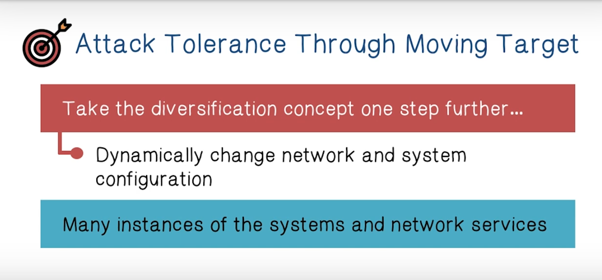
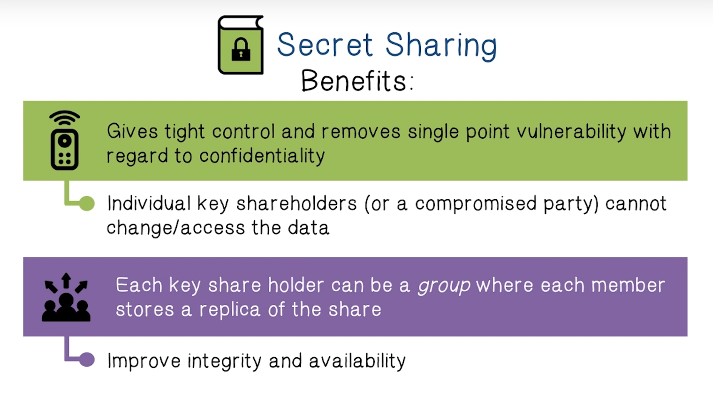
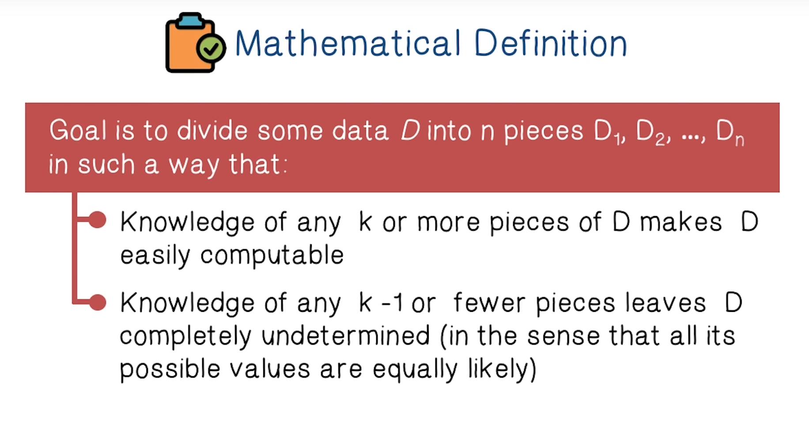
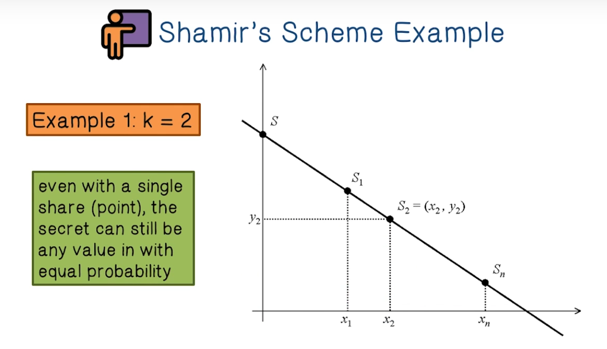
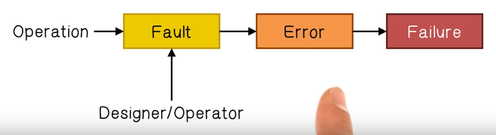
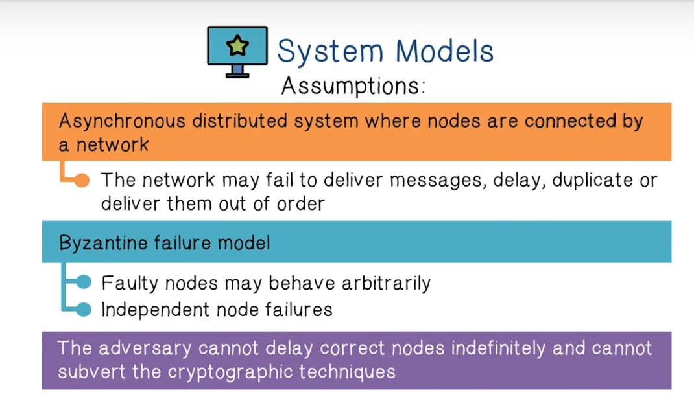

# Week 12 Attack Tolerant Systems

Attack Tolerant Systems Lectures

Reading - How to share a secret

Reading - Practical Byzantine Fault Tolerance

How do we build systems that can withstand attacks?

The internet is a scale-free network. We can infer that is has a high degree of tolerance towards random failures and a low degree of tolerance against attacks. The most successful attacks target the nodes that are most connected.

Here are three ways to detect** node connectivity**.

* Averaged Node Degree -  nodes with the largest number of nodes connected to them
* Node Persistence - during snapshots of internet traffic, these nodes are the ones most likely to appear
* Temporal Closeness -  nodes that interact with the largest number of nodes

The principles of **Defense in Depth** is

* Prevent
* Detect
* Survive

In principle, survival means that our data and our system services should survive. Our data should continue to be confidential, have integrity and be available. Our services should be available and have integrity.

Often strategies for preserving one of these properties can have adverse effects on the other. Take the strategy of replicating data across servers. This improves integrity because it will be harder for an attacker to DDOS all of our servers, but it weakens our confidentiality because now there are multiple points of failure.

In cryptography, **secret sharing **refers to a method for distributing a secret amongst a group of participants, each of which is allocated a share of the secret. The secret can only be reconstructed when the shares are combined together. 

So how does it work?

**Shamir's scheme for secret sharing** involves using the properties of polynomials to reconstruct a polynomial expression to reveal the secret. 

Let's now discuss how to make system services fault tolerant. 

A **fault** is the cause of an error that leads to a system failure.

We can mask faults with **redundancy**. We create a set of services that can reach a consensus even in the presence of some corrupted or faulty members.

* **Availability**
* **Reliability**
* **Safety **
* **Maintainability**

In order for a distributed asynchronous system to achieve fault tolerance we typically require that it has **safety** (see above) and **liveness** ( the clients of the system will eventually receive responses to their requests). 

We cannot apply fault tolerance techniques directly to achieve attack tolerance. The main reason is that fault tolerance uses redundancy. If one machine is susceptible to an attack, they all are. Thus we need to use **diversification** to become attack tolerant. 
