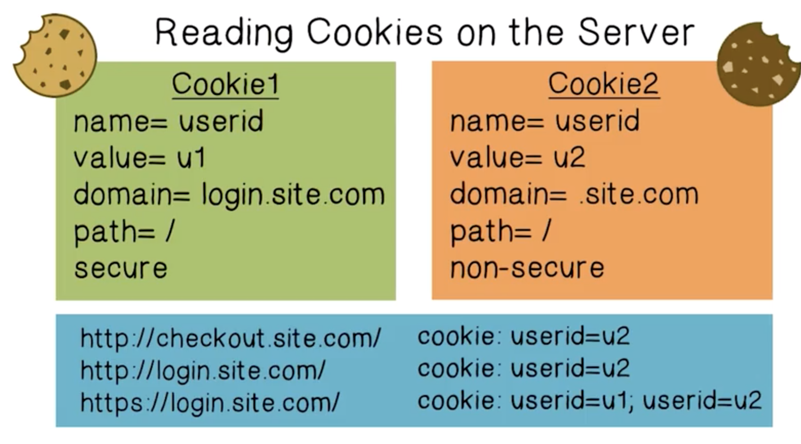
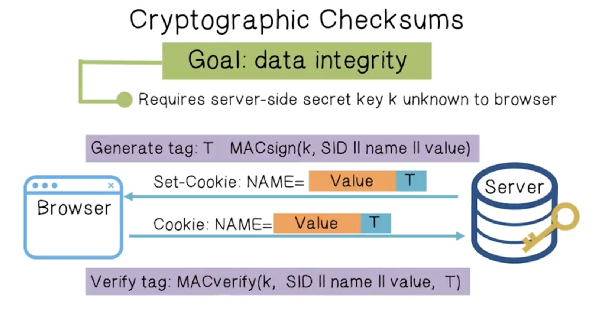

# Week 2 - Penetration Testing and Browser Security

Penetration Testing Lectures/Notes

Browser Security Lecture/Notes

Quiz 2 (9/7/19)

Submit Project 1 (9/9/19)

Readings

* A look back at security problems in TCP
* An Illustrated guide to DNS vulnerability ~ DNS poisoning is an exploit whereby an attacker tricks a resolver to point to it. This can happen at a very large scale and be dangerous.
* BGP Security in Partial Deployment ~ Half-delivered secure BGP isn't very effective, it is still susceptible to downgrade attacks. It is about as effective as Message Authentication
* Securing Frame Communication in Browsers
* The Security Architecture of Chromium
* Exposing private information through timing
* Intro to Content Security Policy ~ Use CSP to to prevent XSS attacks, it is a whitelist for what you can load on a page.
* Play safely iFrames ~ CSP allows you to whitelist trusted sources, iFrames and their sandbox attributes allow you to add more fine-grained control into your website around third-party code. 
* Web Workers
* Using CORS

Notes

Penetration Testing Lectures

**Penetration Testing**  - is used to evaluate the security of a network, more specifically it used to evaluate the security controls (procedures, operations, and technologies used). 

* **Footprinting** - Reconaissance and information gathering: network IP ranges, namespace, topology
    * **whois **
    * **nslookup **

* **Scanning**
    * **nmap **

* **Enumeration**
* **Gaining Access**
* **Escalating privilege**
* **Pilfering**
* **Covering Tracks**
* **Creating Backdoors**

When should penetration testing be done?

* Regularly, if not regularly, then when infrastructure, applications or security patches are added. Also, when end user policies are changed.

What is **social engineering**?

* Manipulating legitimate users into undermining their own security system
* Common social engineering techniques include
    * Impersonating help desk, third-party auth, or tech support
    * Tailgating, roaming the halls
    * Pop-up windows, IMs, email attachments, email scams, phishing websites

Notes

Browser Security/ Advanced Web Security Lectures

Some common web/browser attacks:

* **Using components with known vulnerabilities - **
* **Missing function level access control - **Privilege functionality is hidden rather than enforced through access controls
* **Sensitive data exposure - **Abuses lack of data encryption
* **Security misconfiguration - **Exploits misconfigured servers
* **Insecure direct object references - **Attackers modify file names
* **Cross site scripting - **Inserts JavaScript into trusted sites
* **Broken authentication and session - **
* **Injection - **Modifies back-end statement through user input

Goals of Web Security

* No stolen information
* Site A cannot compromise session at site B
* Applications delivered over the web should be able to achieve the same security properties as applications run on our computers.

Web Security Threat Model

* Attacker sets up a malicious site and waits for users to visit. They do not have access to the network.
* Can obtain SSL/TLS certificate for malicious website
* Can trick user using phishing or redirection
* Web attackers are

Network Security Threat Model

* Much more active than the web security attacker, can intercept and control the network.
* **Passive and active**

The most general and powerful attacks are **malware**. These programs escape the isolation mechanisms of the browser and run separately under the control of the OS.

Comparing OS and Web browser as execution environments

Basic Execution Model of Web Browsers

The basic idea of browser security is to **sandbox** web contents. Safely execute JavaScript code so that it cannot directly access the file system, has limited access to the OS, network, browser data and content that came from other websites.

The main policy is **Same Origin Policy (SOP)** which states that active code can only read properties of documents and windows from the same origin (protocol, domain and port). There are some exceptions to this, users can grant privileges to certain scripts.

**Origins **are defined by protocol, domain and port. 

For the DOM, the Same Origin Policy (SOP) states that Origin A can access Origin B's DOM if A and B have the same protocol, domain and port.

For Cookies, the the Same Origin Policy (SOP) states that Origin A can access Origin B's cookie if they have the same domain and path. Protocol is optional.

**Frames and iFrames** are like miniature browser windows. A frame is typically rigid or fixed on a page, whereas an iFrame can be floating. 

Browsing Context

* A frame with its DOM
* A web worker (thread), which does not have a DOM, JavaScript that runs in the background that is independent from UI

Every **Browsing Context** has an origin, is isolated from others by the same-origin policy, may communicate with other browser contexts using postMessage, and can make network requests using XHR (XML HTTP Request) or tags (<image>).

There are similarities between a browser context and an operating system context. OS's uses separation and isolation to allow multiple execution contexts and provide storage and communication services. Web browsers do the same!

Here are some examples of how modern browsers manipulate their context.

The goal of **Content Security Policy (CSP)** is to prevent and limit damage of **XSS (cross-site scripting)**.

**XSS** attacks bypass the same origin policy by tricking a site into delivering malicious code along with intended content.

With **CSP**, a browser can be instructed to **only load resources from a white-list**.

* Can be specified by scheme: https, etc.
* Can be specified by host name: matching any origin on that host
* Can be a fully qualified URL
* Additionally, you can have 'none', 'self', and different wild card matching.

**Web Workers** were not intended for security, but they improve it because they allow JavaScript to be run in isolated threads. Web workers have the same origin as the frame they were created in, but they have no DOM. They can communicate using postMessage.

**Subresource Integrity **- author of content specifies a hash of the resource they are loading. The browser then checks the hash of the content they are loading. When an integrity check fails, by default, the browser reports a violation and does not render/execute the resource. Or, optionally, the browser can report the violation, but still execute the resource.

**Cross-origin resource sharing** - A technique that is used to relax same-origin policy, which allows JavaScript on a web page to consume content from a different origin. A good example of this would be [amazon.com](http://amazon.com/) and aws. This technique uses white-lists

**SOP and cookies**

* The strict option on the 
* **HttpOnly**

Cookies can set **scope** for any domain-suffix except the top-level domain. So, for example. The website [login.site.com](http://login.site.com/) can set cookies for all of .site.com

Cookies are identified by name, domain and path. Browsers send all cookies that are in scope. 

JavaScript can be used to set, read, and delete cookies. The only exception to this is when the HttpOnly option is set. This means the cookie cannot be assessed by client-side scripts.

What does the statement, "the server is blind", mean in regards to cookies?

* Servers cannot see cookie attributes, and they cannot see which domain set the cookie. This can be exploited.

The problem here is that [course.site.com](http://course.site.com/) expects session-id from login.site.com, but cannot tell that the session-id cookie was overwritten.

Network attackers can intercept and re-write HTTPs cookies. HTTPS cookie values cannot be trusted.

Users can change and delete cookie values. So why are they even useful?!

Data integrity can be achieved using cryptographic checksums on the cookie values

