# Week 3 & 4 - Web Session Management/HTTPS/Security of Internet Protocols/DNS Security

Quiz 3 - 90/130 OUCH! Take better notes on papers and take more time!

Quiz 4 - Take before September 30

Lectures

1. 6 - Web Session Management
2. 7 - HTTPS
3. 8 - Security of Internet Protocols
4. 9 - Domain Name Systems Security

Project 2

1. 1.1 - XSS scripting
2. 1.2 - Framebusting
3. 2.1 - Open Redirect
4. 2.2 - Clickjacking
5. Submit Project 2 (09/25/19)
6. Extra Credit Project 1

Papers to read

1. (Optional) Web Workers
2. (Optional) Using CORS
3. (Optional) Securing Frame Communication in Browsers
4. (Optional) Force HTTPS
5. (Optional) Origin Cookies
6. (Optional) Toward Short-lived Certificates
7. (Optional) Web Session Management
8. An Illustrated guide to Kaminsky DNS Vulnerability
9. P roblems with TCP/IP
10. BGP Security in Partial Deployment

**Notes**

**Web Session Management Lectures**

A **session **is a sequence of requests and responses from one browser to one or more sites. Without session management, users would constantly need to re-authenticate.

The goal of session management is to authorize users once, all subsequent requests can then be tied to the user. This is accomplished using s**ession tokens**. 

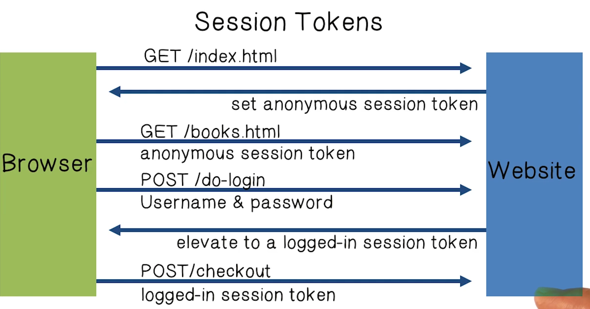

There are many ways to **store a session token**:

1. A browser cookie 
2. Embedded in a URL
3. In a hidden form field (every user action)

The **HTTP Referrer Header** shows the page you are coming from. The web server can check this to see where the user is coming from and do something based on this location.

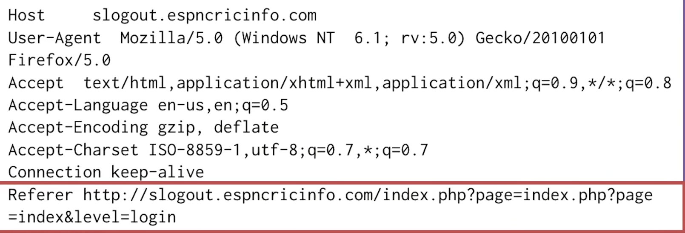

The problem with the referrer header is that it can leak the session token, so you should always obscure it with the no referrer option.

During Logout:

1. Delete session token from client.
2. Mark session token as expired on server.

**Session hijacking **is a major threat in web application security. In this attack, an attacker waits for a user to log in, sniffs their token, and then uses it to do bad stuff! Session hijacking doesn't just happen with an active network hacker, if the granting website doesn't use strong token values (uses a counter, or weak MAC tokens), a hacker can spoof through trial and error. _We should use tokens that are not predictable._

A good example of an unpredictable token would be:

```
Token = md5(current_time, random_nonce)
```

Even when a token is completely random, there is still a threat of theft from network attackers via **man-in-the-middle** attacks or cross-site scripting (**XSS**). Ex: If a login is over HTTPS, but subsequent requests are over HTTP,  a network attacker can sniff the token included in the HTTP requests.

Attackers can also exploit **Session Fixation attacks** to actually get a user to set a token for them.

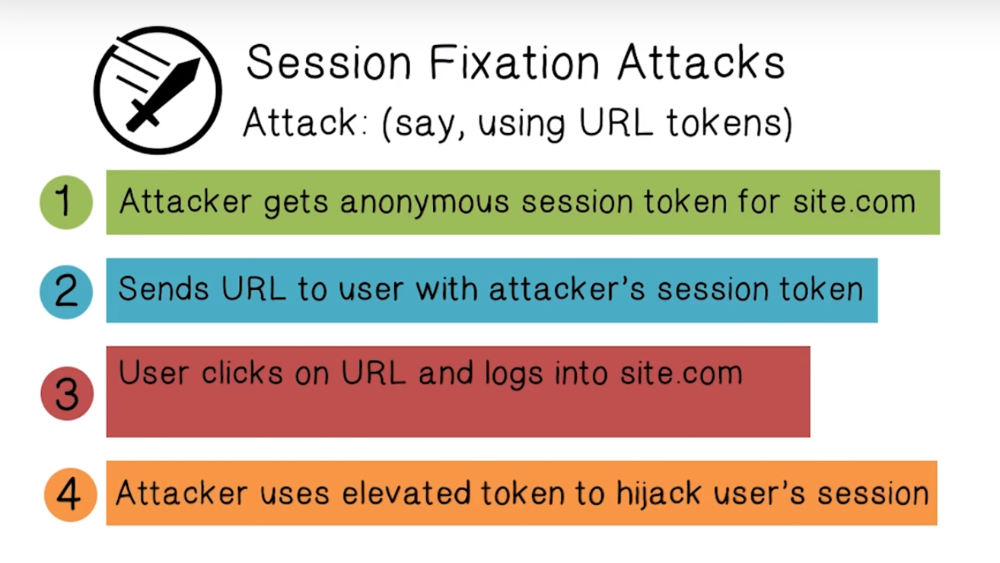

Websites should always issue a new session token when a user logs in, that way the value will be changed and unknowable to the attacker. (The attacker's token above will not be elevated)

**HTTPS Lectures**

**HTTPS (Hyper Text Protocol Secure) **is an application layer protocol that is essentially **HTTP over SSL**, whereby **all communication** between the browser and a web server is **encrypted**.

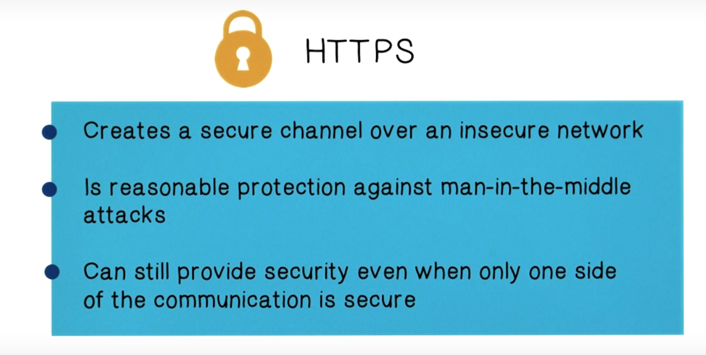

_Why is HTTPS not used for all web traffic?_ Cryptography can slow down web servers.

HTTPS was designed to thwart network attackers

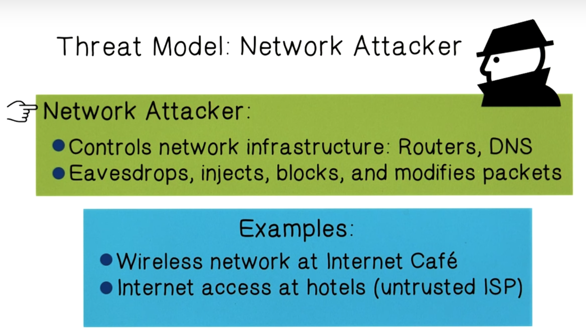

**SSL/TLS **- Public Key Cryptography. Alice uses Bob's public key to encrypt a message she wants to send to him. Only Bob can decrypt the message. But _how does Alice obtain Bob's public key? _

* Typically we use a

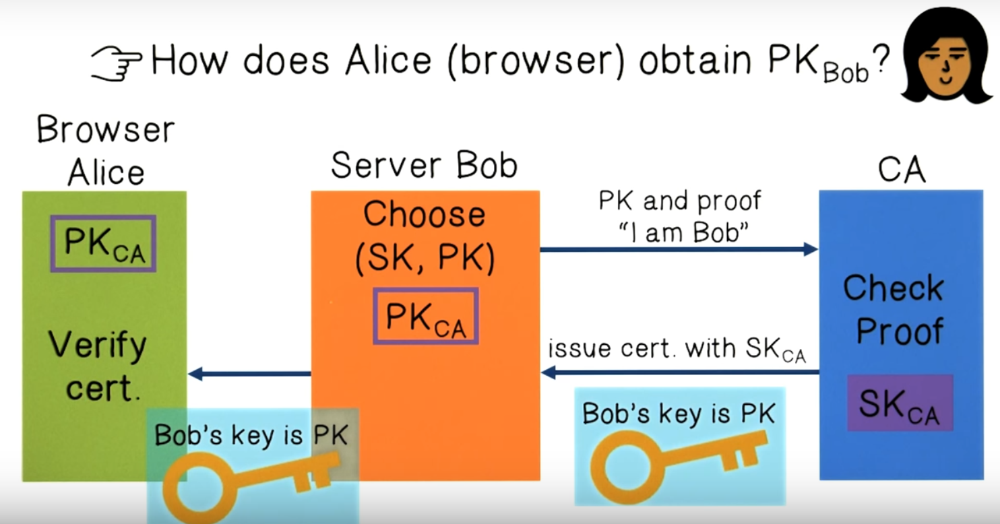

An SSL/TLS handshake allows for two computers to create a secure connection for communication. 

An** SSL strip attack** is a man in the middle attack whereby an attacker downgrades a connection from HTTPS to HTTP. It intercepts an https request from a user and forwards it to a web server and waits for the response, creating a secure connection between attacker and web server. The attacker than forwards a response with HTTP to the user. 

The solution to this attack is **HSTS (Strict Transport Security), **a header that tells a browser to **always connect over HTTPS even for subdomains**. 

Another security problem is **Forged Certificates**, if a CA is hacked, an attacker can issue certs for trusted entities like Gmail, Yahoo, etc. These certs can allow bad guys to pretend like they are a trusted site.

One approach to deal with rogue certificates is to use **Dynamic HTTP public-key pinning**, which is a security feature that tells a web client to associate a specific cryptographic public key with a certain web server. If on subsequent visits, the CA is signed with a different public key, the client can reject the connection.

Another solution is **Certificate Transparency **whereby CAs must advertise a log of all certs they have issued, and a browser will only use a cert if it is published on a log server. An efficient implementation uses a Merkle Hash tree

**Security of Internet Protocols Lectures**

Computers within the same network use local and inter-domain routing to communicate with each other.

Computers from different networks use TCP/IP (or other protocols) to communicate, but in order to talk to the right person they are dependent upon BGP for routing announcements. The Domain Name System finds an IP address from a symbolic name.

ISPs connect their networks together through a process called **peering.** Traffic is allowed to flow across a network in exchange for free access to other networks. ISPs can be broken up into three tiers.

1. Tier One - A network can reach every other network through peering
2. Tier Two - A network that peers some of its network access and purchases some of it
3. Tier Three - A network that purchases all transit from other networks

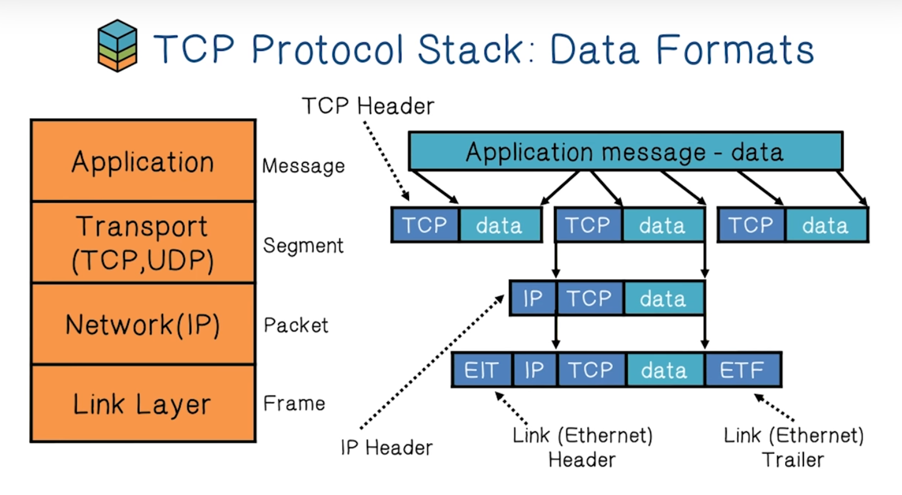

Network data formats are driven by **encapsulation**, a process of translating data from one protocol into another protocol so that it can continue across a network. Let's use a Web server as an example.

1. Application: The message begins as an HTTP response
2. Transport: HTTP runs over TCP, so before it leaves the host computer, the original HTTP response is wrapped in a TCP segment.
3. Network: TCP depends on the IP protocol, before it leaves the host computer, the TCP segment is wrapped in an appropriate IP packet. 
4. Link: As the packet travels hop-for-hop along the route to the requesting computer, it gets different Link Layer Frames.

Internet Protocol (IP) is **connectionless** which means it is an unreliable  and best-effort service (not guaranteed delivery).

* If the destination did not receive a packet (detected through TCP), it can send an 
* The TTL field in the IP packet is decremented with each hop, a packet is dropped if TTL=0, this prevents infinite loops.
* **IP Authentication**

Transmission Control Protocol (TCP) is **connection-oriented**, which means it is reliable and preserves order.

* TCP packets have sequence numbers, TCP packets are reassembled and placed in order at the destination. Packets are acknowledged at the receiver and lost packets are resent by the source.
* The 
    1. **SYN packet**
    2. **SYN/ACK packet **
    3. **ACK packet**

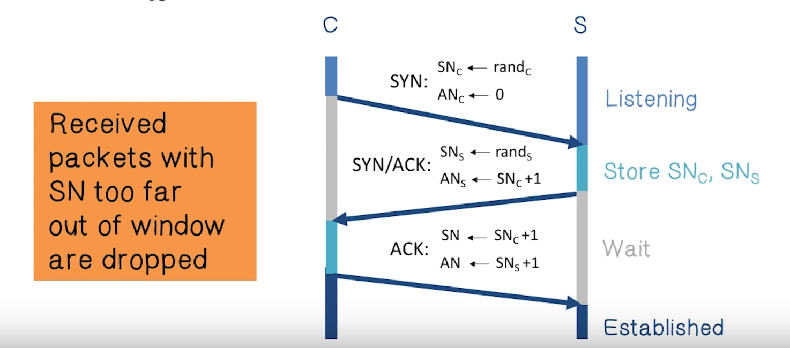

**What are some security issues with TCP?**

* Network packets will pass by untrusted hosts, this means that they can be 
* TCP SYN packets can be used for

**Address Resolution Protocol (ARP) -** A protocol designed to map IP network addresses to hardware addresses used by a data link protocol

**Open Shortest Path First (OPSF) **- A protocol that uses a link state routing algorithm and falls into a group of interior routing protocols.

**Border Gateway Protocol (BGP)** - A protocol designed to exchange routing and reachability information among Autonomous Systems (AS)

**Autonomous System (AS)** - Connected group of one or more Internet Protocol prefixes under a single routing policy (aka domain). The internet is a collection of AS's.

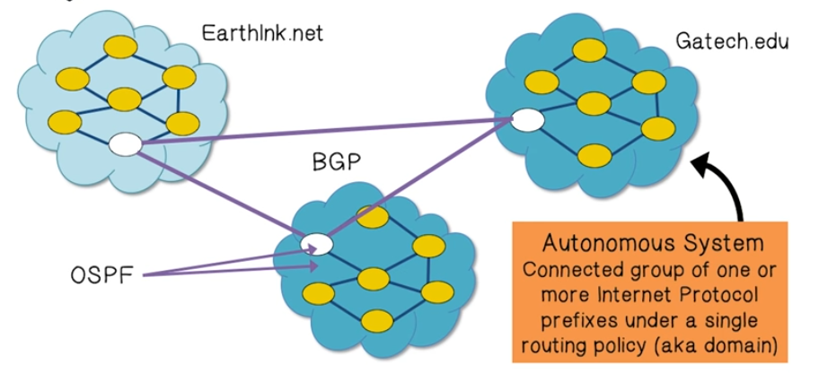

The main security issue with BGP is that **BGP path attestation (advertisement) is un-authenticated**. Anyone can inject advertisements for arbitrary routes. A solution to these issues is to make sure the each AS obtains a certificate from a Regional Authority and attaches the certificate to path advertisement.

**S-BGP **is a variation of BGP that utilizes **IPsec **to create secure point-to-point router communication. It depends on PKI infrastructure to allow for authorization amongst all S-BGP entities. This protects BGP from erroneous or malicious route updates.

**Domain Name System Lectures **

DNS is a hierarchical database that associates domain names with IP addresses. There are root servers, top-level-domains, second-level domains, third-level domains.

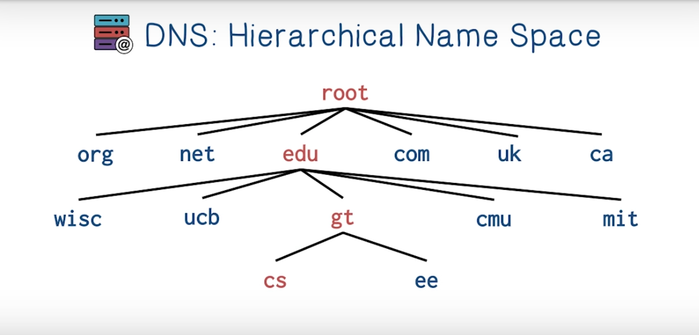

There are thirteen DNS **root name servers**. A root name server directly answers requests for records in the root zone and answers other requests by returning a list of authoritative name servers for the appropriate top-level domain.

A **DNS lookup** is a recursive or iterative process querying the hierarchy of the DNS.

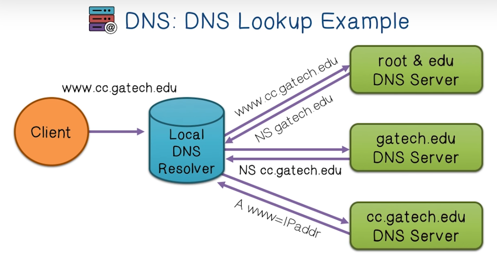

There are several **DNS record** types that can be returned by a DNS query:

1. **NS record**
2. **A record: **
3. **MX record**
4. **TXT record**

Changing a domain name into an IP address involves a surprisingly large number of steps. To save time, the records are **cached** on a local server for reuse later. Each record has a **TTL **to state how long a record can be kept for future use.

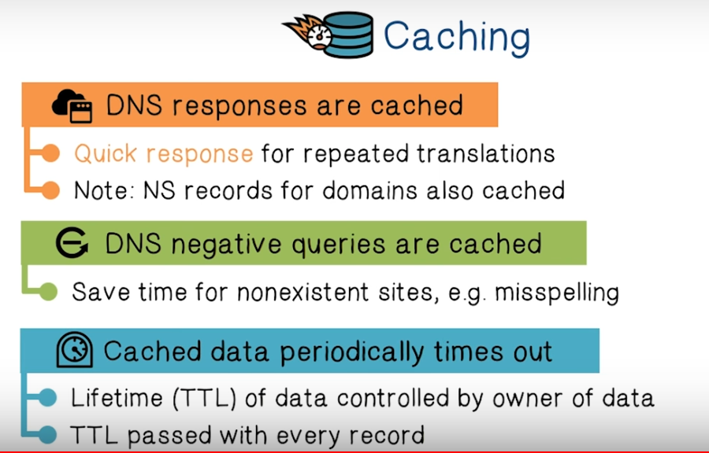

The main vulnerabilities of DNS, is that users and host must be able to trust the host-address mapping provided by the DNS. Many security policies depend on this connection, specifically the Browser Same Origin Policy. One solution to these compromises is that **DNS queries can be authenticated** using **DNSsec (uses PKI)**.

All domain names and IP addresses are stored in the **Central Registry** of the DNS. It can take several days for information to propagate to all DNS servers.

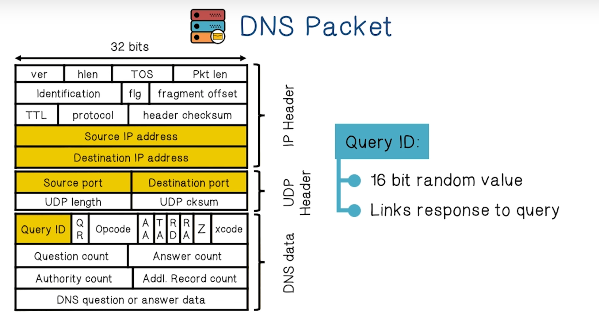

DNS is an application layer protocol that relies on UDP for transport. This means that there is **no guaranteed delivery** of the packet. 

**Cache poisoning **- give DNS servers false records and get it cached. The existing defense in DNS is to use a 16-bit request identifier to pair queries with answers. This means the the attackers response must have the ID that matches the ID of the original query. This can be overcome with Brute-force methods. 

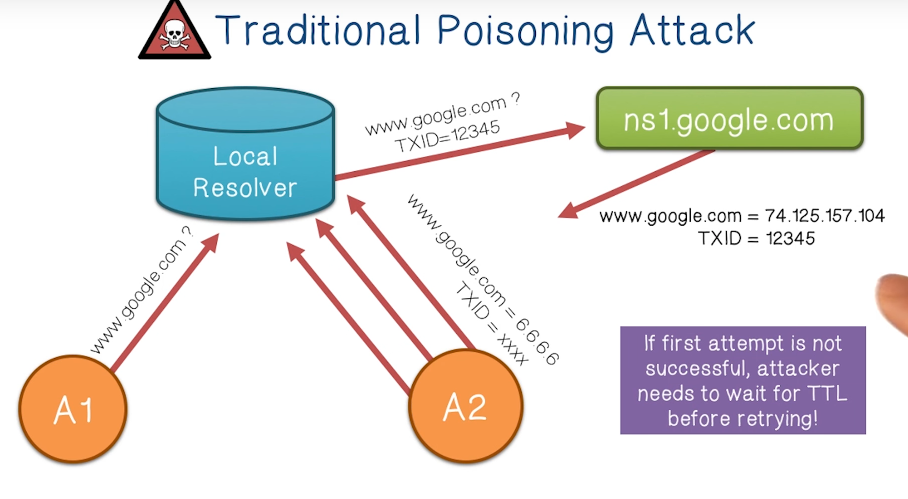

In DNS Cache poisoning, an attacker sends a flood of responses to the local DNS server with the Answer record forged to the evil site and a guessed query (transaction) ID. 

The** Kaminsky poisoning attack** uses the same general principle as the DNS Cache poisoning attack above, except it attempts to poison the Authority records (the servers that are supposed to answer for a specific domain). This attack is much more devastating because in the original attack, the attacker needed to wait for the TTL before attempting to attack again. But in the Kaminsky attack the attacker can just query for another random domain and begin flooding the resolver again. 

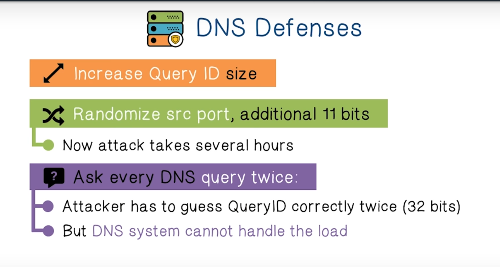

Another option is using encryption to authorize all DNS queries (DNSsec).

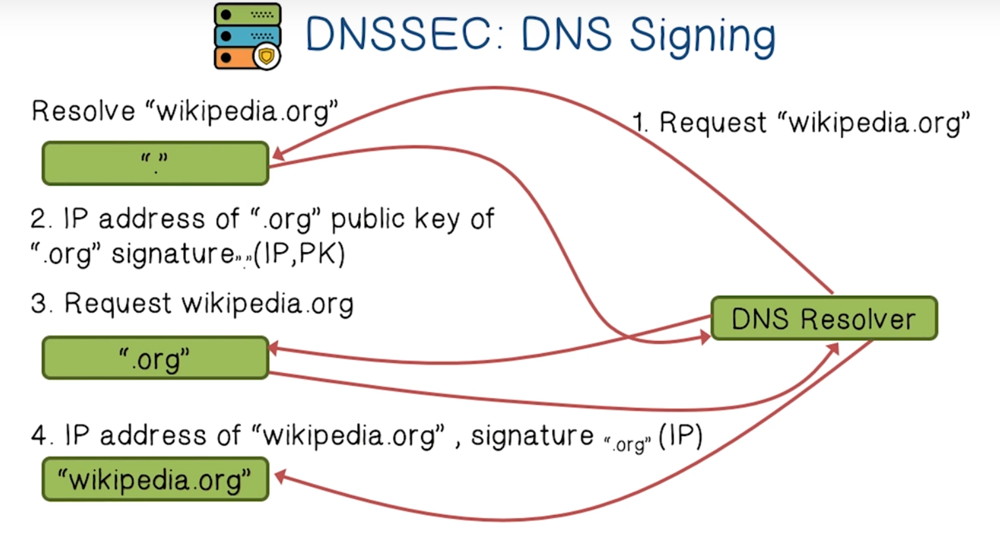

Some DNS attacks can't be surmounted by DNSsec though. For instance, **DNS Rebinding**, an attack that lets you send commands to systems behind a victim's firewall. 

1. In this attack, an attacker registers a domain and delegates it to a DNS Server that is under the attacker's control.
2. The DNS Server is configured to respond with a very short TTL with a record that points back at it itself. The short TTL prevents the DNS response from being cached. This makes a victim's system check again to see what the IP is.
3. The victim visits the attackers site and the malicious Javascript on the attacker's page (evil.com) makes a query to evil.com, the TTL has expired, and the attacker then rebinds the hostname to an internal IP address. Now, the JavaScript running on the victim's computer can issue queries to services within the firewall. 
4.

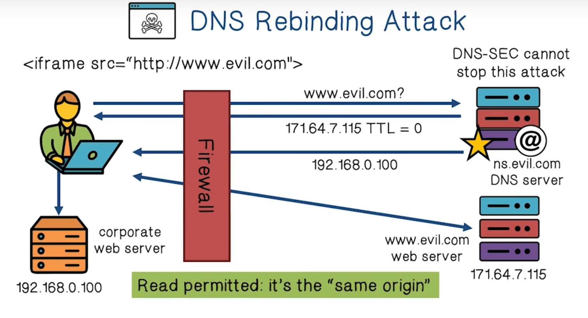

To mitigate this kind of attack, a browser should use **DNS pinning**, which would refuse to switch to a new IP for a specific domain.
