# Week 5 Advanced Malware Analysis and Mobile Malware

1. Quiz 5 - Due by October 7
2. Project 3 - Due by October 17
    1. Set up Project
    2. See Project 3 Tab

3. Lectures
    1. Advanced Malware Lectures
    2. Mobile Malware

4. Papers
    1. Malware Analysis via Hardware Virtualization Extensions
    2. Automatic Reverse Engineering of Malware Emulators
    3. Exploring Multiple Execution Paths for Malware Analysis

**Advanced Malware Analysis Lectures**

Malware is constantly evolving, some of the traditional defenses are not adequate.

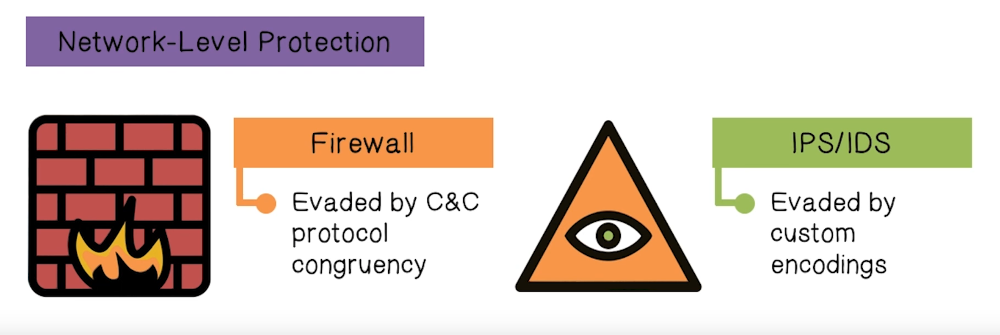

It is difficult for firewalls to detect Command and Control traffic because it can look just like normal traffic. Intrusion detection systems have traditionally used signature matching techniques, these are not useful when viruses use obfuscation or custom encodings.

**Packing **- is an obfuscation technique whereby parts of an executable file are compressed, encrypted or transformed in some fashion. The transformed code looks like data, not an executable, so the antivirus software can't just look for executable programs. In addition the variability of the packing leads to the prevention of signature matching.

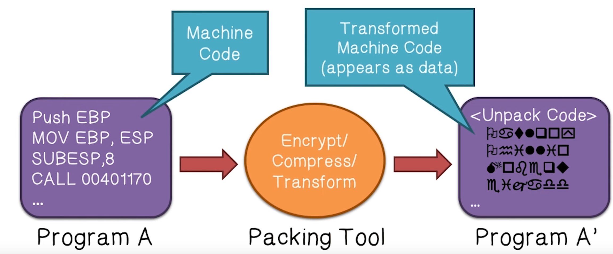

**Server Side Polymorphism - **An attacker sends updates to the compromised computer so that any analysis has to constantly keep up with the changing attack code. 

**Malware Analysis** is important, it can lead to improvements in network and host level detection/blocking, and it can be used for threat/trend analysis. That being said, automation has made malware creation very easy and there are constantly new threats. 

**The Malware Uncertainty Principle** - applies to sophisticated malware the change their behavior based on whether they have been observed. Typically, Malware analysis is invasive, and **some malware is smart and will refuse to run if it detects that it is being probed**.

One solution to this problem is having analysis tools that fake the interaction with the malware so that it thinks it is being run maliciously, but is actually being probed by a forensics tool. One thing that makes this difficult is that **analysis programs running on an operating system are often not given root access**. This means that malware can look for non-privileged exceptions or side effects.

The state of the art in malware analysis is to use **emulation-based approaches**. There have been attacks that detect full system emulation and actually exploit the analyzing computer through the incomplete emulation (i.e the hardware and instructions aren't EXACTLY matched up between an emulated environment and a real environment). **Unfortunately, there is no way to guarantee that an emulator performs exactly like a real machine**.

Malware can use network-timing measurements to infer the presence of an analyzer. This is a really hard problem to evade. 

There are four main ways you can analyze malware, from easiest to hardest they are:

1. Fully-automated analysis: use fully automated tools
2. Static property analysis: examine the static properties of the malware such as metadata, strings embedded in the malware, header details, etc.
3. Interactive behavior: run the malware in a protected and isolated environment
4. Manual code reversing: use a disassembler and decompiler to recreate the malware code.

**Transparent malware analysis** is the analysis of malware that lets the malware execute the same way it would in a real system. This means not being detected! There are some formal requirements of transparent malware analysis:

1. **Higher privilege**
    2. **No non-privileged side-effects**
    3. **Identical basic instruction execution semantics**
    4. **Transparent exception handling**
    5. **Identical measure of time**

Malware Analyzer Architecture

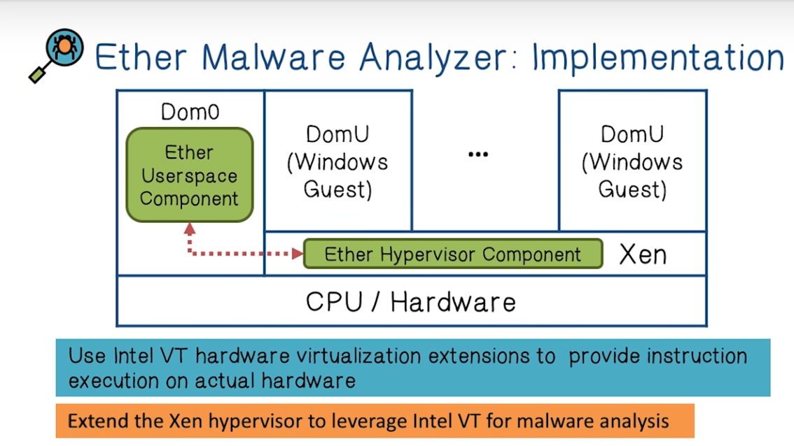

A recent trend in malware is **emulator obfuscation**.

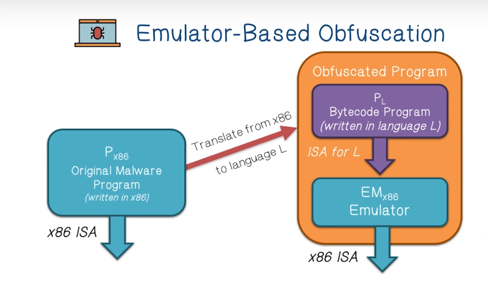

In this attack, the vector is the arbitrary language L, and this language can be randomly generated because it only needs a compatible emulator to be executed. Pure static analysis is thus thwarted. Manual reverse-engineering of this type of vector takes a lot of time and cannot scale to cope with the myriad possibilities. Each malware instance can have a new byte code language and emulator.

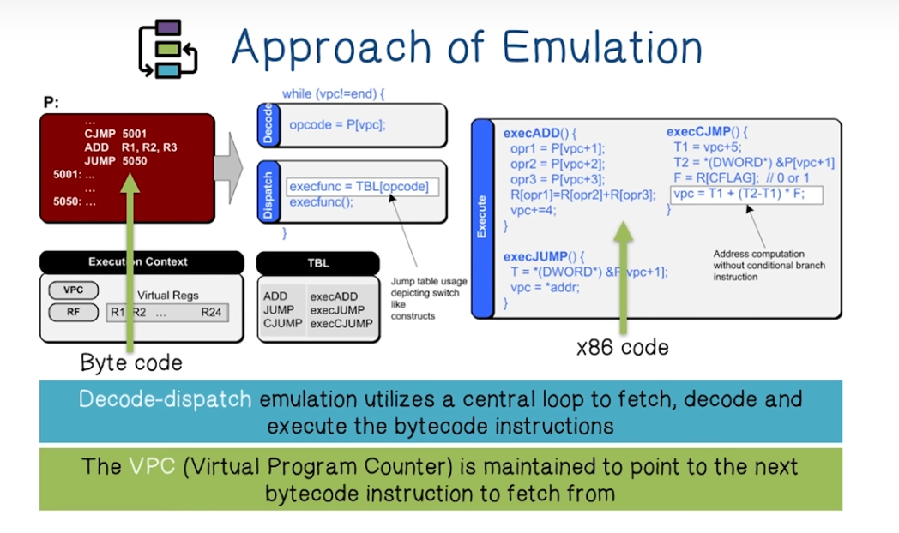

Identifying VPCs in an emulator can allow us to understand the execution patterns of the emulator. Once that pattern is discovered, we can extract the byte code syntax and semantics and try to understand what the byte code is trying to accomplish.

**Mobile Malware Lectures**

Mobile devices tend to use specialized hardware, many different versions of OS and have a large number of accessories. This makes malware analysis difficult!

iOS uses authentication codes to verify that an application was purchased by the App Store. One attack on iOS involves a man-in-the-middle attack that has the attacker simulate the iOS store and use their own authentication codes to trick the victim's mobile device into installing malware. 

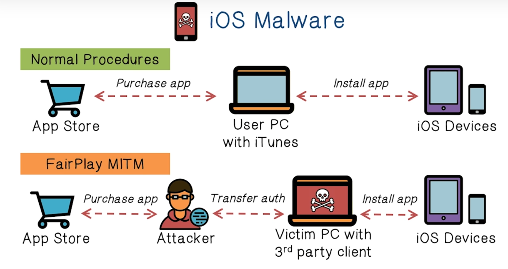

**Open question: Since App download is now done through the store on iPhones, how does malware get distributed? (**[https://blog.malwarebytes.com/mac/2019/08/unprecedented-new-iphone-malware-discovered/](https://blog.malwarebytes.com/mac/2019/08/unprecedented-new-iphone-malware-discovered/)**)**

Historically, iOS has never been completely free of malware, but most of it has been of two scenarios: hacking it to remove security restrictions (jail-breaking) or you have****been the target of a nation-state adversary. The difficulty with infecting an iPhone is that it requires a **zero-day vulnerability,** an exploitable vulnerability that has not been disclosed yet. 

**iOS jailbreaking **is the privilege escalation of an Apple device for the purpose of removing software restrictions imposed by Apple on their operating systems. This is typically done with a series of kernel patches. **It permits root access to the operating system**, allowing the installation of software unavailable to the Apple App Store. 

The majority of Android malware is distributed through **SMS Trojans.** These types of malware send SMS messages without the user's knowledge and have a fee associated with them.

A general guide for malware lifetime

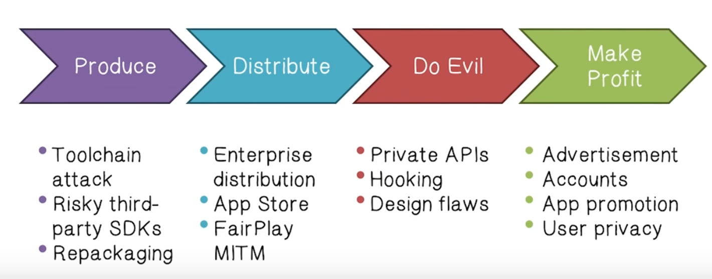

**Toolchain attacks** are an effective way to distribute malware. In 2015, an infected version of Xcode, the iOS application builder, was discovered in china. Apps compiled with these version of Xcode were infected with malware. They would collect information on devices and upload it to a command and control server. 

Another technique is to deliberately submit a vulnerable app to the App Store that has dynamic runtime vulnerabilities that are hard to discover during the iOS submission process. During the review process, the App Store tries to discover all possible control flow execution paths, but because the dynamic runtime vulnerabilities need a specific keyword, they are hard or impossible to discover. 

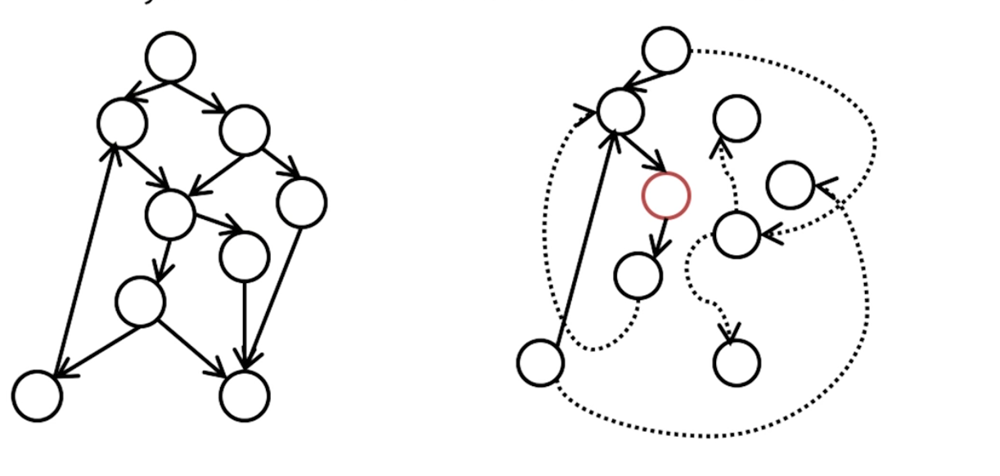

Typical Control Flow vs Dynamic Runtime Control flow

All the main steps of the C-based toolchain can be hardened to improve security. The steps of the C-based toolchain are:

1. Configuration
2. Preprocessor
3. Compiler
4. Linker

**The most effective way to distribute malware is repackage versions of legitimate applications. **Thus detecting clones is an important security measure.

Static analysis tools can be used to detect these clones. Also syscall-level analysis (behavioral) can detect potentially destructive syscalls being made and execute them within isolated threads (tool called PREC). 

One of the most important analyses for detecting malware is **data flow analysis**. Broadly, this technique analyzes movement from source locations to sink locations. It summarizes what information is being stolen. This can be used on legitimate applications to make sure there is no API abuse or data theft.

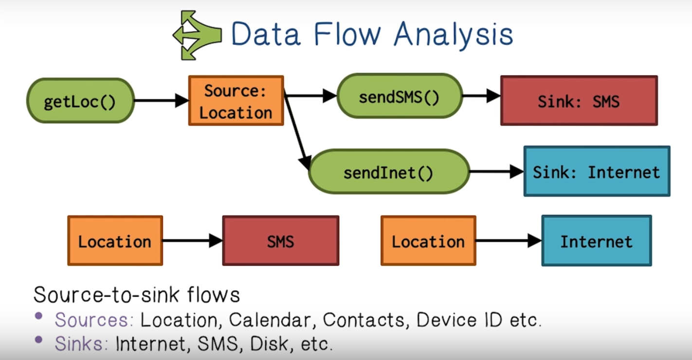

Often analyzing code in the full context of the mobile OS is too computationally expensive because there is a lot of code. One approach is to abstract away the operating system. This only identifies problems in the applications, not zero-day exploits in the operating system.

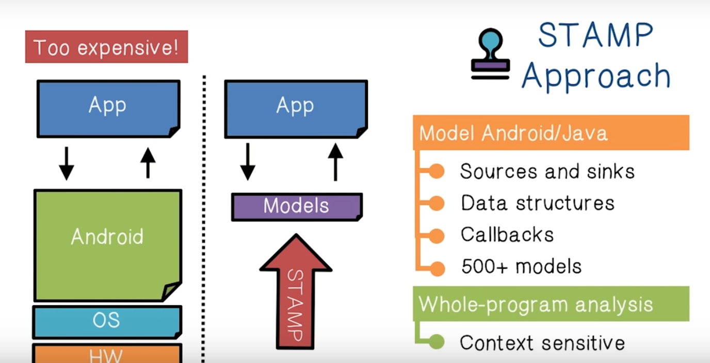

To give you an idea of how many possible combinations of data flow source and sinks there are, here are some examples:

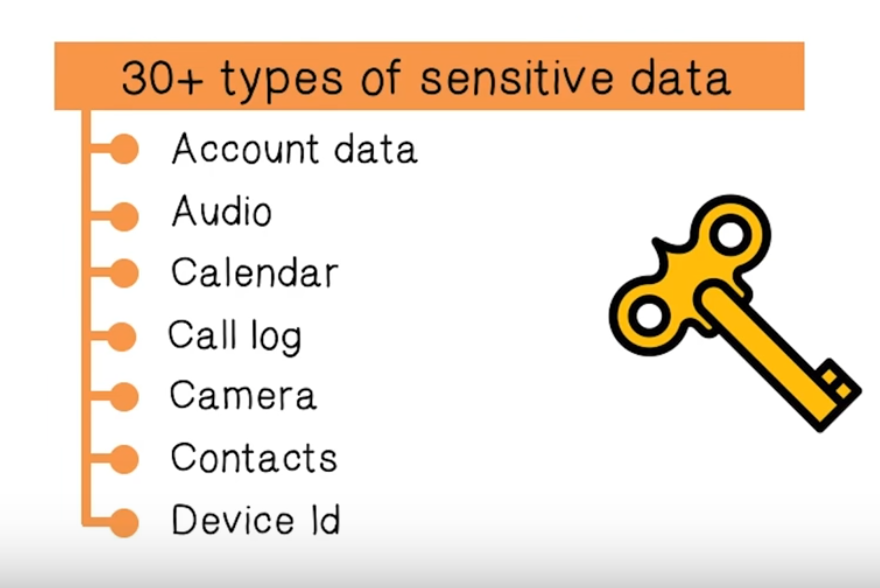

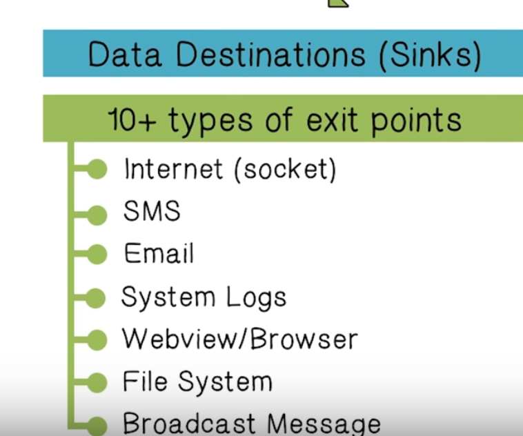

Each pair of source and sink is a **flow type**. 

**Recommended Readings Summary**

**Ether: Malware Analysis via Hardware Virtualization Extensions****Ether: Malware Analysis via Hardware Virtualization Extensions**

**Malware analysis **is the process that extracts the runtime behavior of malware and supplies signatures to detection systems and provides evidence for recovery and cleanups. Malware analysis_ must not induce side-effects that are detectable by malware_. 

Malware Analysis should be **transparent**

1. **Higher privilege: **
2. **No non-privileged side effects: **
3. **Identical basic instruction execution semantics: **
4. **Transparent exception handling: **
5. **Identical measurement of time: **

How is this implemented? Ether uses the Xen hypervisor to do **hardware virtualization**. All this means is that it uses a virtual machine. 

The **hypervisor****is software that runs at the lowest and most privileged layer of the system. **It oversees multiple operating systems, known as domains. One of these domains has special privileges and this domain is known as domain 0. It serves as the administrative center of Xen.

Domain 0 I sth only domain with direct access to real hardware. The guest Ones, rely on the hypervisor for privileged operations. Ether runs as a component in the hypervisor layer and a UserspaceComponent in Dom0. 

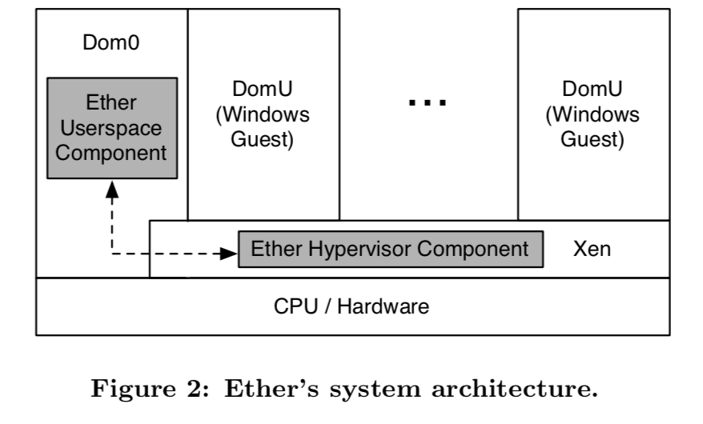

Ether is able to monitor the instructions executed by a agues process, any memory writes a guest process performs, and any system calls a guest process makes. 

**Jekyll on iOS: When Benign Apps Become Evil****Jekyll on iOS: When Benign Apps Become Evil**

iOS has many security features likeiOS has many security features like

* **Address Space Layout Randomization (ASLR): **technique to prevent exploitation of memory corruption vulnerabilities. ASLR randomly arranges the address space of key data areas of a process, including the base of the executable and the positions of the stack, heap and libraries to prevent an attacker from reliably jumping to an exploited place in memory.**Address Space Layout Randomization (ASLR): **technique to prevent exploitation of memory corruption vulnerabilities. ASLR randomly arranges the address space of key data areas of a process, including the base of the executable and the positions of the stack, heap and libraries to prevent an attacker from reliably jumping to an exploited place in memory.
* **Data Execution Prevention (DEP): **
* **Sandboxing: **provides a tightly-controlled set of resources for a guest program to run in.
* **Mandatory App Review: **inspects every app submitted by third parties (in binary form) and only allows it if it does not violate regulations
* **Code Signing: **

The **Jekyll attack** is a method against the App Store review process and the code signing mechanism. With this method, attackers can create malicious, or term-violating apps that they can publish to the App Store. The key to the attack is that instead of submitting explicitly malicious functions. The attack plants remotely exploitable vulnerabilities (backdoor) in a normal app, that decomposes the malicious logic into small code gadgets and hides them behind legitimate functionalities.

After the app passes review and lands on an end user device, the attacker can remotely exploit the vulnerability and assemble the malicious logic at runtime by chaining code gadgets together.
