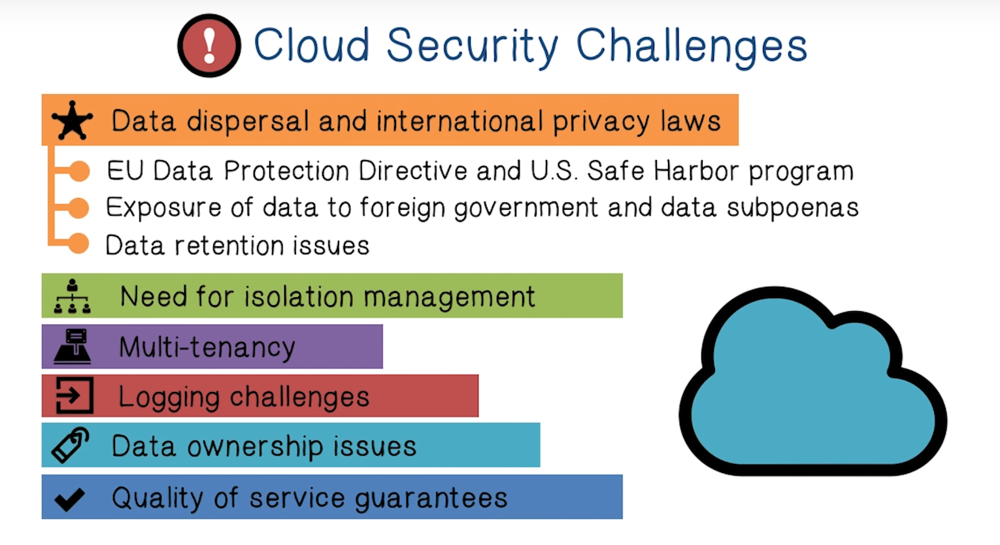
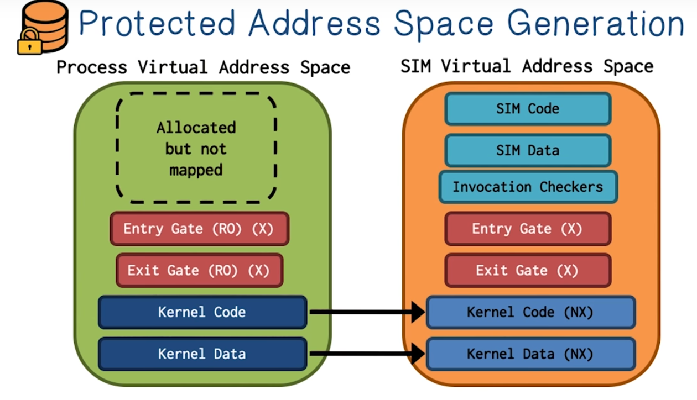

# Week 6 Cloud Security

Project 3 - Due Oct 17

Quiz 6 - Due Oct 16

Lectures

1. Cloud Computing - VM Monitoring
2. Property-Preserving Encryption - Oblivious RAM

Reading

1. Secure and flexible monitoring of VMs (need to read)
2. Secure in VM monitoring using VT
3. Practicing Oblivious Access on Cloud Storage
4. Inference Attacks on Encrypted Databases

**Cloud Computing Lectures**

**Cloud Computing** is a model for enabling convenient, on-demand network access to a shared pool of configurable computing resources (networks, servers, storage, applications). The resourced can be **rapidly provisioned** and released with **minimal management effort** or service provider interaction.

There are three cloud service models:

1. **Software as a service**
2. **Platform as a service**
3. **Infrastructure as a service **

**Private Cloud -** cloud infrastructure is operated solely for an organization. It may be managed by the organization or a third party provider. And it may be on-premise or off-premise.

**Community Cloud **- Cloud infrastructure that is shared by several organizations and supports a specific community with shared concerns. It may be managed by the organization or a third party provider. And it may be on-premise or off-premise.

**Public Cloud **- The cloud infrastructure is made available to the general public or a large industry group. It is owned by the group offering the services.

**Hybrid Cloud** - The cloud infrastructure is a composition of two or more of the previous categories.

_What are some common characteristics that are shared by these models?_

* Massive scale, Homogeneity, virtualization, resilient computing, low cost software, geographic distribution, service orientation, advanced security

The **essential characteristics** of all cloud environments are that they are:

1. On demand self-service
2. Broad Network Access
3. Rapid Elasticity
4. Resource Pooling
5. Measured Service

NIST Risk Identification

Security is the main concern when people adopt cloud services.

There are some **key security issues** in the massively complex systems of Cloud environments:

1. Trust
2. Multi-tenancy
3. Encryption
4. Compliance

**Cloud Security Advantages**

1. Shifting public data to an external cloud reduces the exposure of internal sensitive data
2. Cloud homogeneity makes security auditing/testing simpler
3. Clouds enable automated security management
4. Redundancy / Disaster recovery is easier

**Cloud Security Disadvantages**

1. Trusting vendor's security model
2. Customer inability to respond to audit findings
3. Obtaining support for investigations
4. Indirect administrator accountability
5. Proprietary software
6. Loss of Physical control

Cloud Application Services can be broken down into several categories

1. Cloud Provisioning Services
2. Cloud Data Storage Services
3. Cloud Processing Infrastructure
4. Cloud Support Services
5. Cloud Network and Perimeter Security
6. Elastic Elements: Storage, Processing and Virtual Networks.

They each have their own security advantages and disadvantages.

Multitenancy is a big potential risk in cloud data storage.

Multiple applications can be run on the same machine. This can lead to side channel attacks on the cloud infrastructure.

Summary: there are a lot of Advantages to the Cloud Security Model

And yet, there are a lot of disadvantages as well.

It's obvious that some of these disadvantages can be solved with encryption. We need to encrypt data at rest and access to applications. 90% of service providers encrypt data in transit. 10% of data is encrypted at rest.

The primary technologies of Cloud Computing are

1. Virtualization
2. Grid Technology
3. Service Oriented Architectures
4. Distributed Computing
5. Broadband Networks
6. Browser as a Platform
7. Free and Open Source Software

The key to cloud computing technology is **virtualization**

It's dangerous to put security tools in the kernel because they can be compromised by malware. Another approach is to use virtualization and introspection to access contents of a user-based VM. 

**Memory analysis** is one of the most important features of Virtual Machine Security. This is because memory is the only reliable source of the current state of a computer system. We can see running and killed processes, encryption keys and decrypted data, networks sockets and data, and os-level accounting information.

Security and Control virtual machines can be used in a production system to monitor memory. There are different approaches for this:

1. **Passive Monitoring**
2. **Active Monitoring**

There are several challenges with VM monitoring

1. **High Overhead**
2. **Introspection Cost:**

**Secure In-VM Monitoring (SIM) **is a technology that utilizes hardware virtualization features to remove the need for a hypervisor (improving latency) and address security issues. 

TO ADD: A BETTER SIM SUMMARY

**Property Preserving Encryption Lectures**

Encryption is an important tool for protecting data. 

**Property Preserving Encryption** leaks frequency. 

**Order Preserving Encryption **leaks order

These properties make it extremely easy to make an inference attack if you are able to recover the encrypted data. The trick is to use **frequency analysis** to defeat equality preserving encryption.

For order-preserving encryption, we can use a **sorting attack or a cumulative attack**. 

How a user accesses data, even if it is encrypted leaks some information about what kind of data is used. Oblivious RAM somewhat solves this issue.

