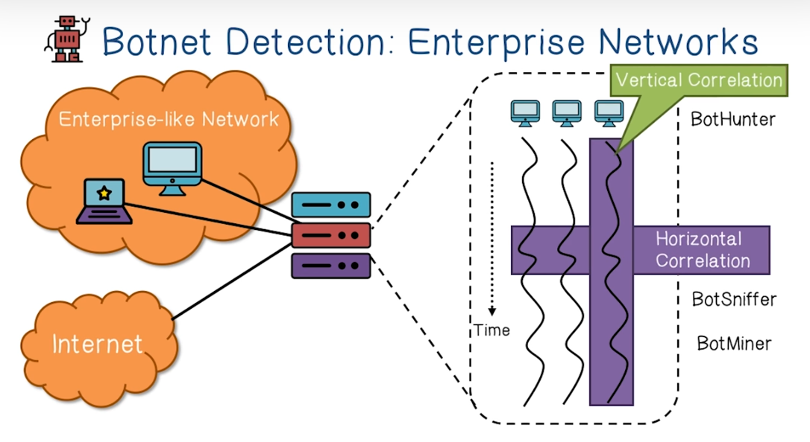
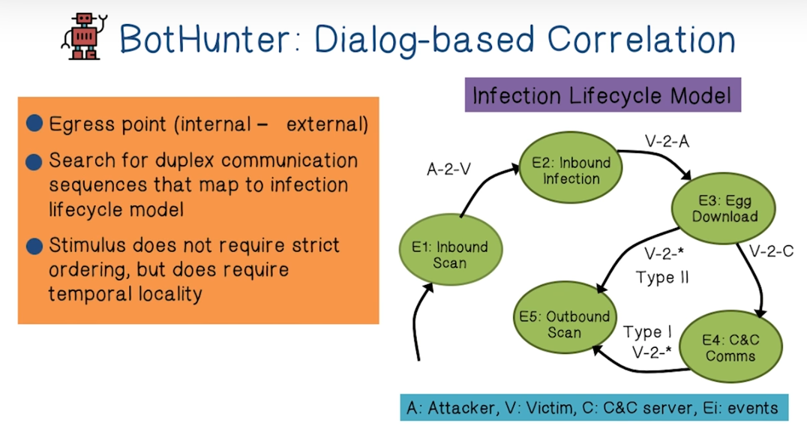
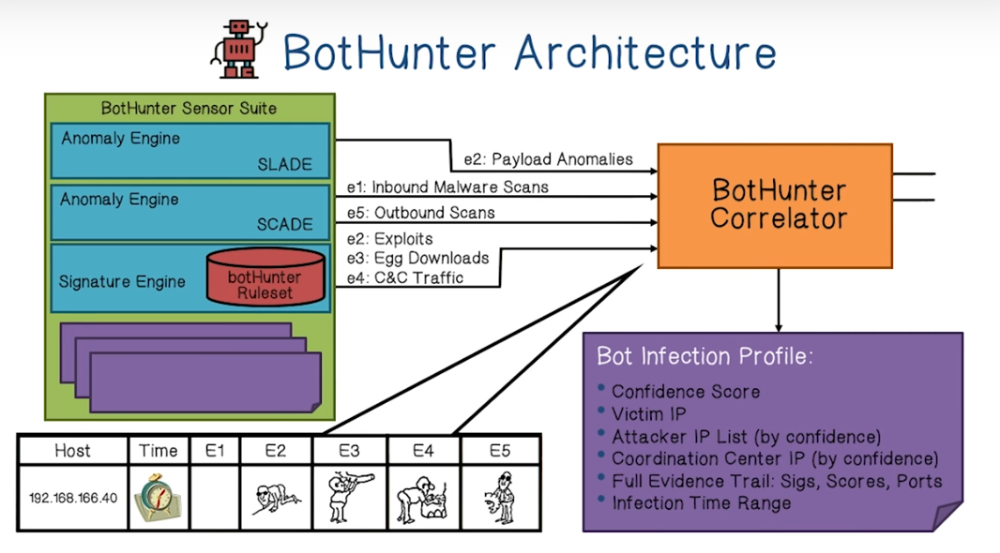
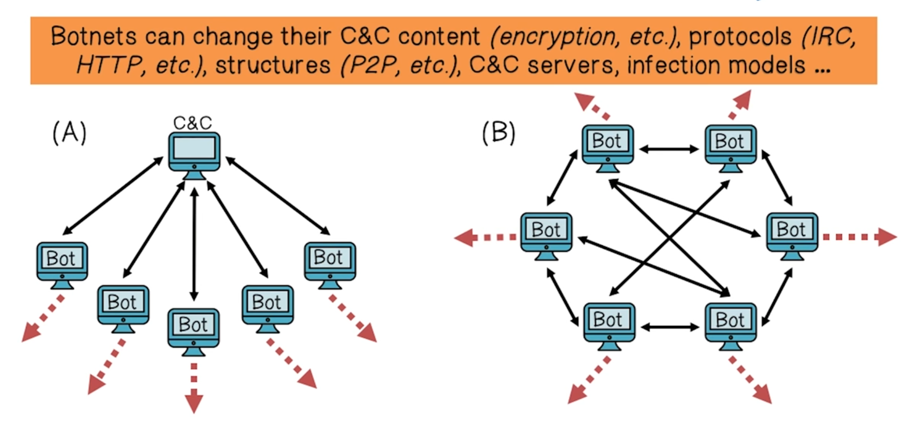
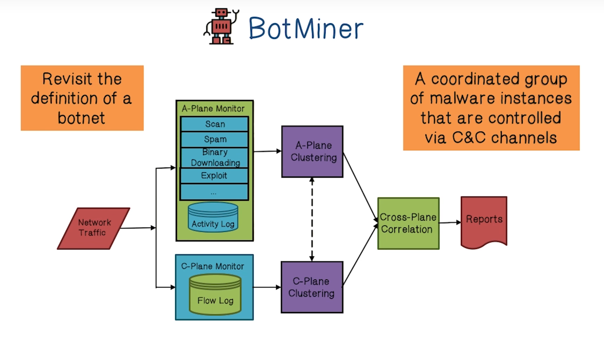
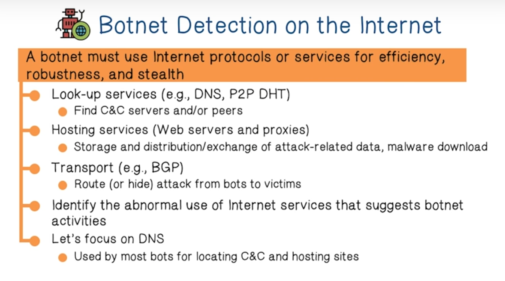
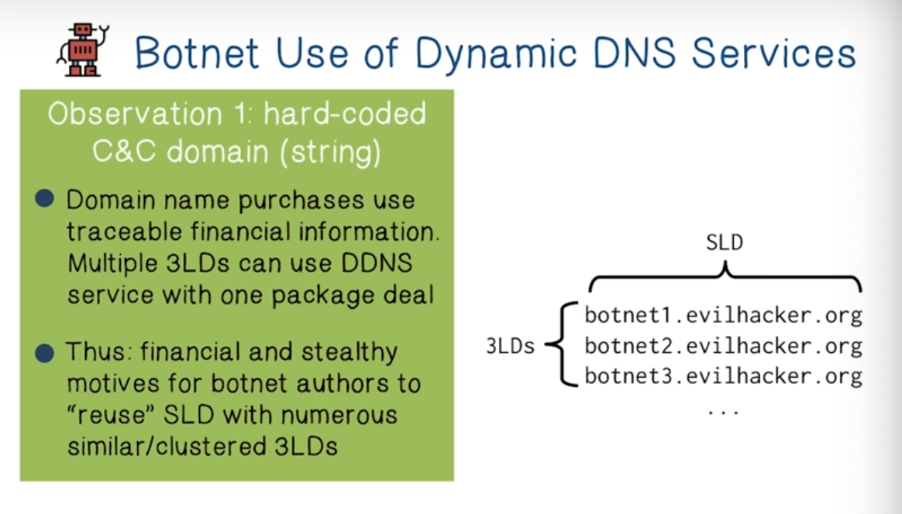
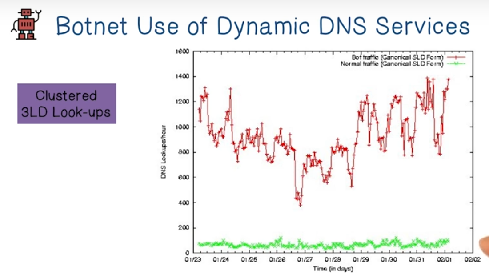
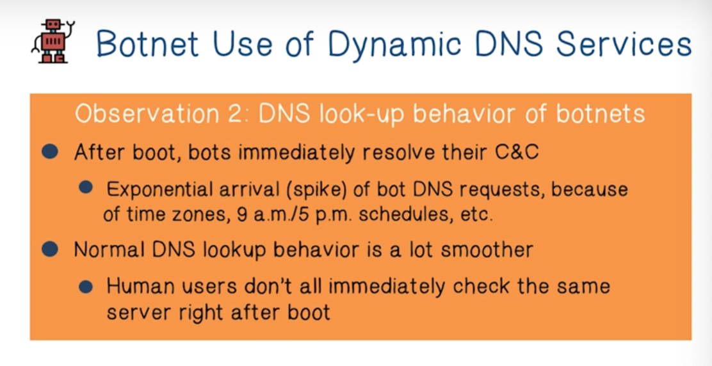
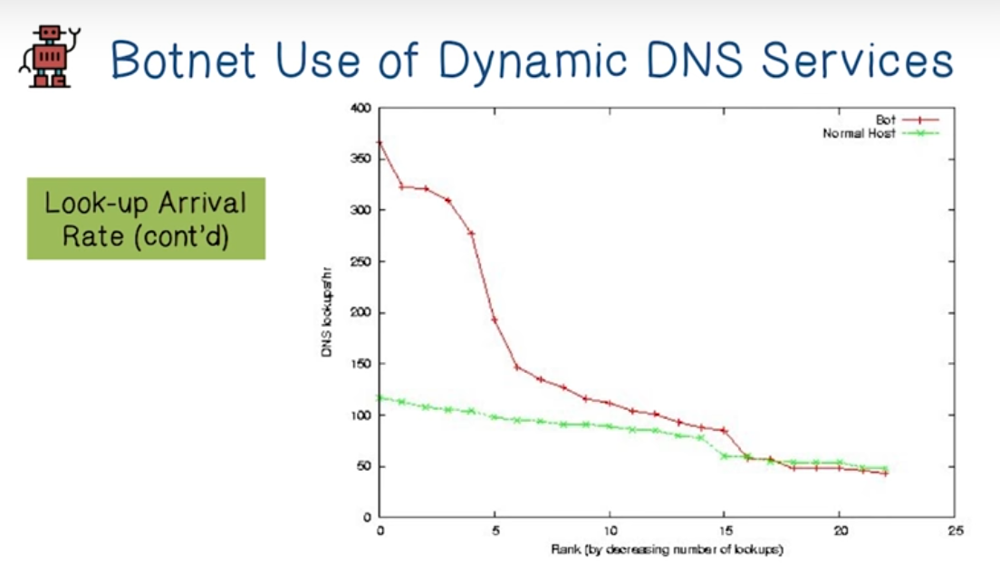

# Week 7 Botnet Detection

Week 7 Quiz - Oct 21

BotHunter

Project 4 - Nov 5

Botnet Detection Lectures

**Botnet Detection Lectures**

The rise of botnets and APTs (advanced persistent threat) has changed the network analysis and malware detection process.

The goal of **network monitoring** is prevent and detect attack traffic. Attack traffic used to be well-defined, ie the payload contained a known vulnerability and you could use a signature to detect it, or the. Volume/rate at which is was happening suggested DoS or Spam.

The traditional tools used to prevent this type of behavior are **firewalls** and **network intrusion detection systems**. 

Unfortunately, they are becoming less effective. Mobile devices can become infected while out of the network, and then employees can bring the compromised device into network. Also, attack traffic is now very subtle.

_Why do traditional security tools fail?_

* Traditional Anti-Virus tools are evaded using packers and rootkits.
* Traditional IDS/IPS are not very effective because they look for a specific exploit, whereas botnets perform multiple activities.

_So what makes detecting botnets so challenging?_

* Bots are stealthy on infected machines (ie they use rootkits to cover their tracks)
* Bot infection is usually multi-faceted, looking for a specific signature won't always work
* Bots are dynamically evolving, they update themselves
* Botnets have various C&C channels that allow them evade detection.

Distinguishing bots means **looking for non-human behavior**. 

**Vertical correlation** looks for patterns of events across a network and time horizon.

**Horizontal correlation** looks for similar or coordinated behaviors across many bots

**Cause-Effect correlation **the defender injects traffic to play with the bot to confirm it is indeed a bot user and not a human user

**Bothunter** uses vertical correlation. Use network traffic to detect patterns in traffic that might suggest malicious activity. Bothunter uses a table to keep track of network traffic.

Bothunter engines:

* SCADE - Custom malware specific weighted scan detection system for inbound and outbound resources. Examples would be failed connections to a vulnerable port, rate of outbound communication, target entropy (how often connections are established)
* SLADE - Detect anomalous network payloads. 
* Signature engine - used to detect known malicious payloads and behaviors

Botminer architecture

* A-plane clustering - machine learning categorizing and clustering based on malicious activity type
* C-plane clustering - categorizing and clustering based on command control traffic
* Use clustering and cross-plane correlation to identify bots in a botnet

So how do you find a botnet?

DNS is commonly used to find C&C servers because DNS is used by most services to reach out to the internet, i.e. it is needed on the host. 

Malware hackers **prefer Dynamic DNS servers** because there is frequent change in mapping of the Domain/IP pairs. 

**Sinkholes** can be used by DNS providers to trap the traffic of botnets and allow for researchers to study the botnet. A sinkhole is just a remapping of the domain to a controlled IP. 

We can use the fact that botnet organizers typically cluster their botnets under a second level domain and look for similar names and cluster all the lookups together. Botnet domains will have higher lookup values. 

Another Heuristic we can use is based on typical behavior of botnets. Often they immediately lookup their C&C when a user logs in. This causes spikes in traffic.

If you have access to a recursive DNS server you can analyze the rate of growth of lookups for particular domain names. Often you only have to look at odd-looking domain names that grow at an exponential rate. 
