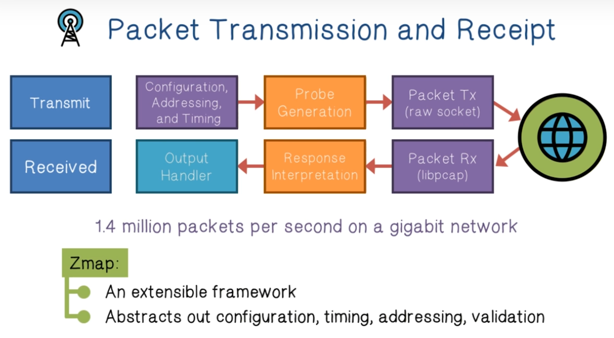
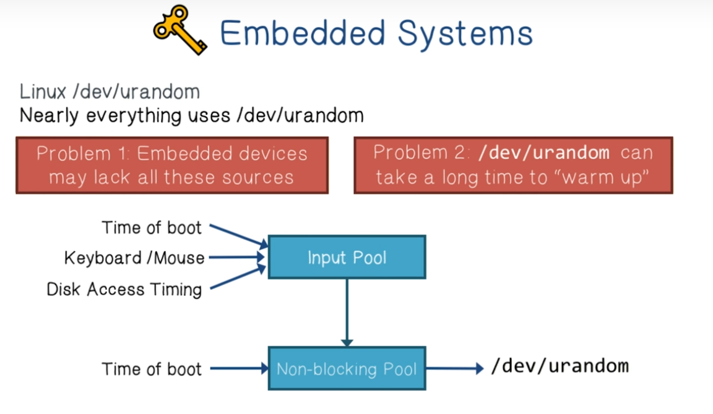

# Week 8 Internet Scale Mapping

** Quiz 8 - October 28**

**Project 4 - November 5**

**Internet Scale Mapping Lectures**

**Footprinting** - The attacker gathers information about a target. The kind of information gathered is: DNS, email servers and the IP address range.

**Scanning** - The attacker uses the internet to obtain information on specific IP addresses. The kind of information gathered is O.S, services, and architecture of the target system

**Enumeration** - the attacker gathers information on network user and group names, routing tables and simple network management protocol.

Internet-wide studies are hard to pull off. They take a lot of computing resources and time. **Zmap** is an open-source network scanner that can scan a single port of every machine on the internet in under an hour.

How does Zmap scan the entire internet without keeping track of all that it has scanned? It scans hosts according to a random permutation.

The only state we need to keep track of is:

* The primitive root
* The current location
* The first address (getting back to this suggests we have iterated through the entire space)

How do we validate responses from targets that are being probed by our internet-wide scanner?

One way is to encode secrets into mutable fields of probe packets that will have recognizable effects on responses. 

ZMap high level process

Statelessness leads to increased performance and coverage. 

**Entropy** is randomness for use in cryptography or other applications that require random data.  The two sources of entropy are hardware sources and randomness generators. A lack of entropy will have a negative impact on performance and security.

Studies have shown that of the many public keys that are online, a lot of them are not distinct. This can sometimes be due to underpowered entropy in the algorithms. This leads to ways to uncover the keys. 

One problem with this setup is that many linux systems don't support the inputs that lead to the entropy generation. Think servers in a rack. 

How are certificates used in web browsers?

The client validates the certificate chain by validating all the keys that exist in the chain. 

