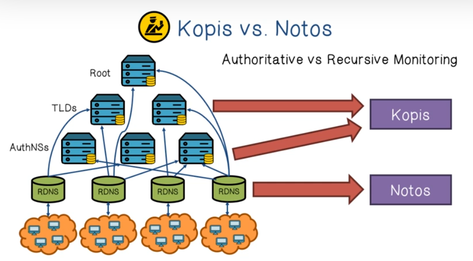
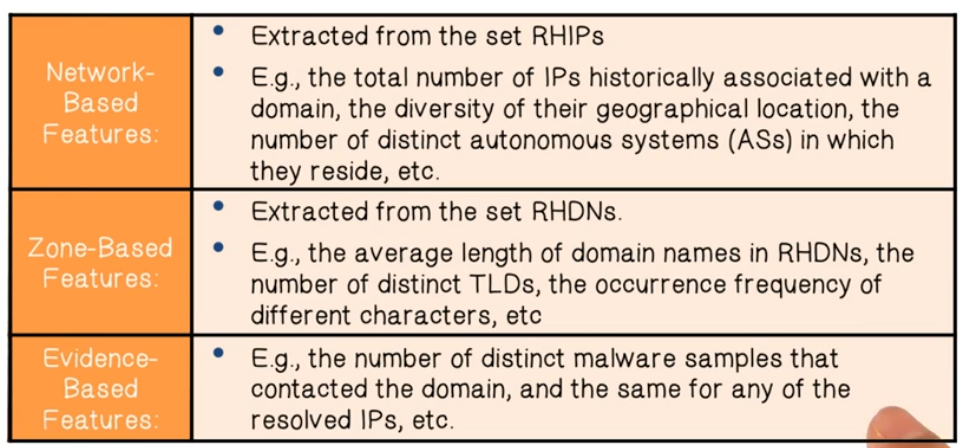
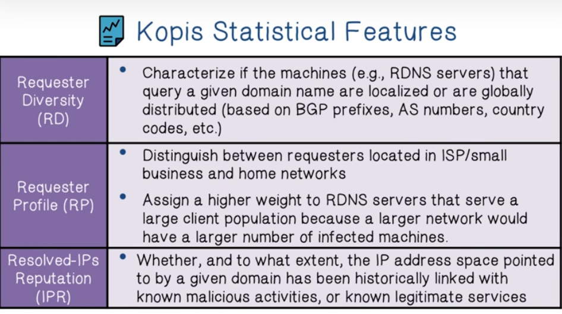

# Week 9 Domain and Network Reputation

Domain and Network Reputation videos

Reading - Building a Dynamic Reputation System for DNS

Reading - Detecting Malware Domains at the Upper DNS

**Domain and Network Reputation Lectures**

**

**

Blacklists are a traditional defense against Spam attacks in email systems. The problem with them is that they are static, and that spammers can always use a new IP if their original IP has been blacklisted.

How would we create a Dynamic Block list? One idea is to analyze DNS traffic. 

* Botnets typically have short-lived domains
* Spyware typically uses anonymously registered domains
* Adware typically uses disposable domains not related to legitimate businesses.

**NOTOS** is a system that dynamically assigns a reputation score for domain names.

**KOPIS** is a system that analyzes DNS queries at Authoritative or Top-Level domain servers.

* Resource Record (RR) - a tuple of domain name and IP address
* 2nd Level Domain, 3rd Level Domain - 2LD =

NOTOS Statistical Features

