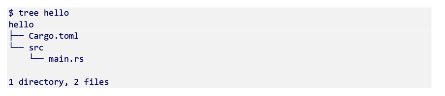

# Ch 1 Introducing Rust

**Introducing Rust

**

**

**

**What is the "nightly" compiler?**

Rust has** three concurrent releases** at any given time: **stable, beta, and nightly**.

* Stable - where most users spend their time. It updates every 6 weeks. Features available in stable Rust will always be available. 
* Beta - primarily used by continuous integration systems. Few humans develop with this version of the compiler
* Nightly - Where new language features are incubated. Buggy code should not live here, all it suggests is that the developer who uses the nightly compiler will accept potential changes to the code in the future, that is that there is no backwards compatibility guarantee.

Many of Rust's features are drawn from two programming sub-fields: systems programming and functional programming. 

* From system's programming, Rust draws the notion of control and willingness to strip back abstraction
* From functional programming, Rust provides efficient implementations of higher-order programming, an impressive type system, pattern matching and first class support of generics
* **The standard library is small**


**

**

**Rust's distinguishing feature** as a programming language is **its ability to prevent invalid data access at compile time**. It guarantees that your** program is memory safe without imposing run time costs**. Other languages can provide this level of safety, but they require adding checks to during your program's execution, thus slowing it down.

Rust is labelled as a systems programming language and has three goals: safety, productivity and control.

* Safety - Rust programs are free from:
    1. Dangling Pointers - live references to data that has become invalid over the course of the program.
    2. Data races - Unable to determine how the program will behave from run to run because external factors are changing.
    3. Buffer Overflow - Attempting to access the 12th element of an array of only 6 elements
    4. Iterator Invalidation - An issue caused by something that is being iterated over and altered mid-way through

* Productivity - When given a choice, Rust prefers the option that is easiest for the developer. Rust has a nice build system and 
* Control -  Control over memory access, memory layout and specific CPU instructions is important when squeezing the best performance out of code. Data within Rust is immutable by default.

Flowing out from the three principles discussed above are three overarching features of the language: performance, concurrency and memory efficiency.

**Rust does not rely on a garbage collector for memory safety**. The Rust compiler aggressively optimizes both the size and speed of your programs. Some other helpful optimizations are:

* Cache-friendly data structures are provided by default. Arrays usually hold data within Rust programs, rather than deeply nested tree structures that are created by pointers. This is referred to as 
* Having a modern package manager (cargo) makes it very easy to benefit from the community.
* Methods are always dispatched statically, unless dynamic dispatch is explicitly requested. This enables the compiler to heavily optimize code.

**Downsides of Rust**

**

**

1. **Cyclic Data Structures**
2. **Slow Compile Times**
3. **Strictness**
4. **Size of the language**

usestd::rc::Rc;

usestd::sync::{Arc, Mutex};

fnmain() {

leta =10;// integer on stack

letb =Box::new(20);// integer on heap (boxed integer)

letc = Rc::new(Box::new(30));// boxed integer wrapped with a reference counter

letd = Arc::new(Mutex::new(40));// integer protected by mutex lock wrapped with reference counter

println!("a: {:?}, b: {:?}, c: {:?}, d: {:?}", a, b, c, d);

}

The example above demonstrates that there are many choices in Rust. It puts the burden of choice on the programmer. Exactly which integer you might need depends on the problem at hand.

It's important to remember that** Rust does not protect you from logical errors**. **Security issues are the domain of the programmer, not the compiler**. Be wary and use good patterns. 

**Where does Rust best fit?**

**

**

Utilities written in Rust are compiled as** static binaries** by default. This method avoids depending on shared libraries. This makes Rust programs easy to distribute. The real answer is basically everywhere.

**Hello World**

**

**

```
~/rust/in_action/ch_1_introduction(master*) » cd /tmp      lkrych@LKRYCH-M-W49D
--------------------------------------------------------------------------------
/tmp » cargo new --bin hello                               lkrych@LKRYCH-M-W49D
     Created binary (application) `hello` package
--------------------------------------------------------------------------------
/tmp » cd hello                                            lkrych@LKRYCH-M-W49D
--------------------------------------------------------------------------------
/tmp/hello(master*) » cargo run                            lkrych@LKRYCH-M-W49D
   Compiling hello v0.1.0 (/private/tmp/hello)
    Finished dev [unoptimized + debuginfo] target(s) in 1.06s
     Running `target/debug/hello`
Hello, world!
```

**

**

Navigate to the **temporary folder**, a directory that is used to hold temporary files in an OS. Many OSes automatically delete the contents of this directory at bootup or at regular intervals.

So, we ended up running code without writing any Rust. 😞 

**Cargo** is tool that is both a **build system and package manager**, this means it knows how to execute **rustc** (**the Rust compile**r) to convert Rust code into executable binaries or shared libraries.

Cargo understands things such as the difference between debug build and a release build. It also knows how to manage **3rd party libraries**, called **crates** in Rust.

In this example, we use cargo to create a new project (boilerplate code). 

Cargo creates a project that follows a standard template that all Rust crates follow. After completing the cargo new command, the directory structure will look like this:



All Rust crates have the same structure:

1. A file called 
2. Source code appears in the

The next command executed was **cargo run**. This is simple to understand, but actually does a lot of work. Where did the output "Hello, world!" come from? As it turns out, src/main.rs always includes a "Hello, world!" stub. The result of that compilation was a the binary hello, which was executed.


Notice the project structure has changed a great deal with the compilation. 

1. We now have a 
2. /target directory which contains the binary and other things.

**Hello International**

**

**

fnhello_international() {

println!("Hello, world!");// the oldest of dear dear friends.

letsouthern_germany ="Grüß Gott!";

letjapan ="ハロー・ワールド";

letregions = [southern_germany, japan];

forregioninregions.iter() {

println!("{}", &region);

}

}

fnmain() {

hello_international();

}

**

**

**Strings are UTF-8** in Rust. This means you are able to use non-English characters with relative ease. 

The **exclamation point** in Rust **signals the use of a macro**. Macros offer the ability to avoid boilerplate code. In the case of println!, there is a bunch of type detection going on under the hood so that arbitrary data types can be printed to the screen.

A lot of languages have a "**garbage collector**", which is a service that tells the operating system that one of your variables has left scope and the memory allocated to the program is able to be used by others. It is a convenient feature, but it causes your programs to run more slowly as they need to do extra work to check which variables are still needed. Rust has no garbage collector.

One thing you might have noticed is that **we haven't added any type annotations**. Rust is **statically typed**, which means that the behavior or all data is defined in advance of the program being run and that the behavior is well-specified. We are able to write the programs above because the compiler is smart.

There are three main command line tools to learn:

* **cargo -** which manages a whole crate
* **rustup -** which manages Rust installations
* **rustc -**which manages compilation of Rust source code
