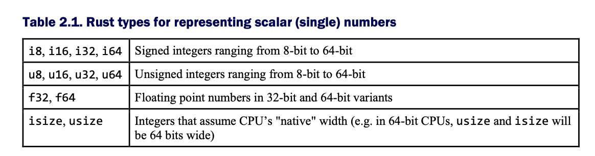
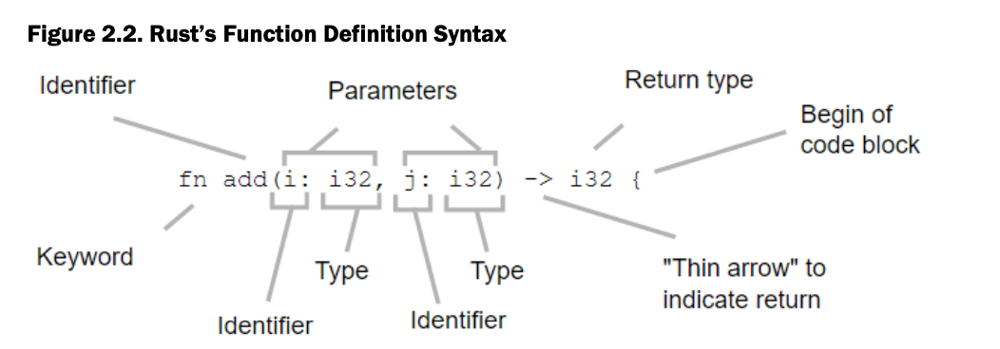

# Ch 2 Language Foundations

fnmain() {

    leta =10;

    letb:i32=20;

    letc =30i32;

    letd =30_i32;

    lete =add(a, b),add(c,d));

    println!("(a + b) + (c + d) = {}", e);

}

fnadd(i:i32, j:i32) ->i32{

    i + j//implicit return

}

The **entrypoint** to all Rust programs is **main**. Unlike C, main can appear anywhere in the file, rather than only at the end. It takes no arguments and returns no values.

The keyword **let** is used to declare **variable bindings**. Variables are immutable by default, meaning that they are read-only rather than read-write.

The compiler is smart and can infer types, but sometimes you need to designate a specific data type. You can see above that Rust's numeric literals can include type annotations. This can be helpful when navigating complex numerical expressions.

The `println!` expression is a **macro**. Macros are function-like, but **return code rather than a value**. In the case of printing, every data type has its own way of being converted to a string. `println!` takes care of figuring out the exact methods to call on its own arguments. 

**Strings** use **double quotes** rather than single quotes, and string formatting uses {} as a placeholder.

**Compile a single file of Rust code**

```
rustc single-file.rs
```

Projects larger than a single file tend to be compiled with a higher-level tool called cargo. Cargo understands how to compile multi-file projects. It executes rustc on your behalf. If you are ever curious about what cargo is doing, use the -v verbose flag. 

**Numbers**

fnmain() {

    lettwenty =20;

lettwenty_one:i32= twenty +1;

    letfloats_okay =21.0;

    letone_million =1_000_000;

    println!("{}; {}; {}; {}", twenty, twenty_one, floats_okay, one_million)

}

Underscores can be used to increase readability, they are ignored by the compiler.

Rust also has built-in support for numeric literals that allow you to define integers in base 2 (binary), base 8 (octal) and base 16 (hexadecimal).

fnmain() {

    letthree =0b11;

    letthirty =0o36;

    letthree_hundred =0x12C;

    println!("base 10: {} {} {}", three, thirty, three_hundred);

    println!("base 2: {:b} {:b} {:b}", three, thirty, three_hundred);

    println!("base 8: {:o} {:o} {:o}", three, thirty, three_hundred);

    println!("base 16: {:x} {:x} {:x}", three, thirty, three_hundred);

}



fnmain() {

    letneedle =42;

    lethaystack = [1,1,2,5,14,42,132,429,1430,4862];

    forreferenceinhaystack.iter() {

        letitem = *reference;

        ifitem == needle {

            println!("{}", item);

        }

        // if reference == &needle { //alternative method of comparing items

            // println!("{}", reference);

        // }

    }

}

The** unary * operator** is called the **dereference operator**. The operator follows the reference and returns its referent. Item is a reference to some number within haystack. *item == needle asks Rust to compare the value referred to by item against needle.

**Type-aware control flow with match**

fnmain() {

// let needle = 42;

lethaystack = [1,1,2,5,14,42,132,429,1430,4862];

forreferenceinhaystack.iter() {

letitem = *reference;

letresult =matchitem {//match is an expression that returns a value that can be bound to a variable

42|132=>"hit!",

_ =>"miss",

};

ifresult =="hit!"{

println!("{}: {}", item, result)

}

}

}

Instead of using if/else block's, you can use Rust's **match** keyword. The match keyword plays an important role within the Rust language. Many control structures, such as looping, are defined in terms of match under the hood.

**Function Signatures**



Rust functions require that you specify your parameters' types and the function's return type.

**Lifetime System**

Rust's functions can also look much scarier. Here is some extra information that can be useful.

add_with_lifetimes<'a,'b>(i: &'ai32, j: &'bi32) ->i32

In general terms, this extra information is providing more specific instructions to the Rust compiler about data that lives outside the function. Functions that use references - denoted by the ampersands preceding the types - have data that exists outside their scope.

Objects that live outside of a function are checked to make sure that accessing them is valid throughout the function. That is, **Rust checks to make sure that all input data will live at least as long as the function needs it**. 

**Underpinning Rust's safety checks is a lifetime system** that works in the background (this is known as lifetime elision). Because of this, lifetime parameters do not usually need to be provided. When they do, **they appear with <> brackets**. In essence, this syntax suggests to the compiler that the variables in between the brackets have **lifetimes that are independent from one another.**

**Generic Functions**

Another special case of function syntax appears when programmers write Rust functions to handle many possible inputs. 

Capital letters in place of a type indicate a **generic type**. Conventionally, the variables, T, U, and V are used, but this is arbitrary, an E is often used to denote an error type. Generics enable code re-use and can increase the useability of a strongly-typed language.

Lastly **generic types can have some constraints** placed on them. To do this, programmers add **trait bounds within angle brackets**, before the parameter list. 

Trait bounds refer to **traits**, a language feature that is analogous to **an interface** or protocol in other domains. Traits are discussed in depth later on. 

usestd::ops::{Add};

fnadd<T: Add<Output = T>>(i:T, j:T) -> T {

    i + j

}

fnmain() {

    let(a, b) = (1.2,3.4);//bind multiple variables with pattern matching

    let(x, y) = (10,20);

    letc =add(a,b);    

    letz =add(x,y);

    println!("{} + {} = {}", a,b,c);

    println!("{} + {} = {}", x,y,z);

}

Here are a few principles that should assist when looking at Rust code:Here are a few principles that should assist when looking at Rust code:

* Terms in lower case (
* Single upper case letters (
* Terms beginning with upper case (
* Labels (

**Grep-lite-v1 - Let's talk about Strings**

fnmain() {

letsearch_term ="picture";

letquote ="Every face, every shop, bedroom window, public house, and

dark square is a picture feverishly turned -- in search of what?

It is the same with books. What do we seek through millions of pages?";

forlineinquote.lines() {

ifline.contains(search_term) {

println!("{}", line);

}

}

}

Rust's strings can do a lot by themselves. Multi-lined strings do not require special syntax. Objects in Rust have methods, strings provide an iterator of lines. 

**Strings can be complicated** for newcomers to Rust.

**String and str** both exist, yet are d**istinct types**. Interacting with values from both types can be an annoying.

**str** is a high performance, relatively feature-poor type. Once created, str data is not copied when it is re-used. This minimizes the interaction between the program and the operating system, resulting in faster runtime performance.

**String** is closest to what you know as a string type from other languages. It supports modification, including expanding and contracting over time. **String is an owned type**. Owned values are guaranteed to live as long as their sole owner.

str is usually seen in its reference form &str and &str is referred to as a "string slice". The full type designation of it is 'static &str. The 

'static lifetime is somewhat spacial. Executable programs can contain a **section of memory that is hard-coded with values**. This section is known as** static memory** and is **read-only during execution**.

**char** is a single character, encoded as 4 bytes (UTF-32). This differs from &str and String, which encodes single characters as UTF-8.

**[u8**]: a slice of raw bytes, usually found when dealing with stream of binary data. 

**std::ffi::OSString**: a platform-native string, very close in behavior to String, but without a guarantee that it's encoded as UTF-8 and won't contain the zero byte.

**Grep-lite adding line numbers**

We have two options for adding line numbers, we can use a mutable type, by using the **mut keyword**. 

fnmain() {

    letsearch_term ="picture";

    letquote ="Every face, every shop, bedroom window, public house, and

    dark square is a picture feverishly turned -- in search of what?

    It is the same with books. What do we seek through millions of pages?";

    letmutline_num:usize=1;

    forlineinquote.lines() {

        ifline.contains(search_term) {

            println!("{}: {}",line_num, line);

        }

        line_num +=1;

    }

}

Or we can use the enumerate method. 

fnmain() {

    letsearch_term ="picture";

    letquote ="Every face, every shop, bedroom window, public-house, and

    dark square is a picture feverishly turned--in search of what?

    It is the same with books. What do we seek through millions of pages?";

    for(idx, line)inquote.lines().enumerate() {

        ifline.contains(search_term) {

            letline_num = idx +1;

            println!("{}: {}", line_num, line);      }

    }

}

**Lists with Arrays, Slices and Vectors**

The two types of lists that you will work with are arrays and vectors.

**Arrays** are fixed-width and extremely lightweight. They are a tightly-packed collection of the same thing. It's possible to replace items within an array, but its size may not change.

**Creating arrays takes two forms**. We can provide a **comma-delimited list** within square brackets ([0,1,2,3]), or we can use a **repeat expression **([0;100]). In a repeat expression, **the left value is repeated by the number of times on the righ**t. 

Both of these variations support providing a type signature.

fnmain() {

    letone= [1,2,3];

    lettwo: [u8;3] = [1,2,3];

    letblank1 = [0;3];

    letblank2: [u8;3] = [0;3];

    letarrays = [one, two, blank1, blank2];

    forain&arrays {

        print!("{:?}: ", a);

        fornina.iter() {

            print!("\t{} + 10 = {}", n, n+10);

        }

        letmutsum =0;

        foriin0..a.len() {

            sum += a[i];

        }

        print!("\t(Σ{:?} = {})", a, sum);

        println!("");

    }

}

Arrays are a simple data structure from the **machine's point of view**. They are **a contiguous block of memory with elements of a uniform type.**

Arrays can still cause some confusion though. The notation can be confusing. [T; n] describes an array's type where T is the elements' type and n is a non-negative integer. It's easy to confuse with slices [T] which do not have a compile-time length.

In practice, most interaction with arrays occurs via another type called a slice [T] that is itself interacted with by reference (&[T]). You can see this in the loop above.

**Slices** are dynamically-sized array-like objects. This means that their size is not known as compile time. Like arrays, though,  **they don't expand or contract**. The use of the word dynamically sized is closer in meaning to dynamic typing. 

Slices are important because it's** easier to implement traits for slices than arrays**. Traits are how Rust programmers add methods to objects. 

Another very important use for slices is their ability to act as a view on arrays. The term view here is taken from database technology and means that slices can gain fast, read-only access to data without needing to copy anything around. 

Rust slice's are made up of two usize components (a pointer and a length), that's why you see slices referred to in their reference form (&[T]). 

**Vectors** (Vec<T>) are growable lists of T. They incur a small runtime penalty because of extra bookkeeping that they do.

They are extremely common in Rust code. Let's return to our grep-lite utility. We would like to store n lines of context around a match. 

To minimize code complexity, we will use a two pass strategy. In the first pass, we'll tag lines that match. During the second pass, we will collect lines that are within n lines of each of the tags. 

The code example below is complex. The most confusing syntax is probably Vec<Vec<(usize, String)>>, which appears on line 15. This is a vector of vectors, where T is of** type (usize, String)**. This is a **tuple** and will be used to store line numbers along with the text that's near matches. 

fnmain() {

    // PARAMETERS

    letcontext_lines =2;

    letneedle ="oo";

    lethaystack ="Every face, every shop,

    bedroom window, public-house, and

    dark square is a picture

    feverishly turned--in search of what?

    It is the same with books.

    What do we seek

    through millions of pages?";

    //Initialization

    letmuttags :Vec<usize> =Vec::new();// tags will hold line numbers where matches occur

    letmutctx:Vec<Vec<(usize,String)>> =Vec::new();// ctx contains a vector per match to hold that match's context lines

    // Pass 1: find matches

    for(i, line)inhaystack.lines().enumerate() {

        ifline.contains(needle) {

            tags.push(i);

            letv =Vec::with_capacity(2* context_lines +1);// reserves space for n items

            ctx.push(v);

        }

    }

    iftags.len() ==0{

        return;// nothing was found!

    }

    //Pass 2: grab lines

    for(i, line)inhaystack.lines().enumerate() {// For each tag, at every line, check to see if we are nearby a match. When we are, add that line to the relevant Vec<T>

        for(j, tag)intags.iter().enumerate() {

            letlower_bound = tag.saturating_sub(context_lines);// usize.saturating_sub is subtraction that returns 0 on integer underflow rather than crashing the program

            letupper_bound = tag + context_lines;

            if(i >= lower_bound) && (i <= upper_bound) {

                letline_as_string =String::from(line);// copy line into a new String and store that locally for each match

                letlocal_ctx = (i, line_as_string);

                ctx[j].push(local_ctx);

            }

        }

    }

// Output

    forlocal_ctxinctx.iter() {

        for&(i,refline)inlocal_ctx.iter() {// ref line informs the compiler that we wish to borrow this value, rather than move it.

            letline_num = i +1;

            println!("{}: {}", line_num, line);

        }

    }

}

**Including Third Party Code**

We would like to include the regex crate into our grep-lite program. **Crates** are the name the Rust community uses where other may use terms such as package, distribution or library. 

**To use 3rd party code**, we'll **rely on the cargo** command line tool. To add dependencies you need to update the **Cargo.toml** file.  In our case, we will update it to include the regex library. 

```
[dependencies]
regex = "1"
```

Run **cargo build** to pull down this crate. 

**Managing Rust Toolchains with rustup**

**

**

**rustup** is another handy command line tool, along with cargo. Where cargo manages projects, rustup manages your Rust installations. rustup cares about "Rust toolchains" and **enables you to move between version of the compiler**. 

**Reading from files**

**

**

Working with files can be finicky. Let's take a look at a more simple example before we add it to grep lite.

The general pattern we will use is to open a file object, then wrap it in a BufReader. BufReader takes care of providing buffered I/O, which can reduce system calls to the operating system.
