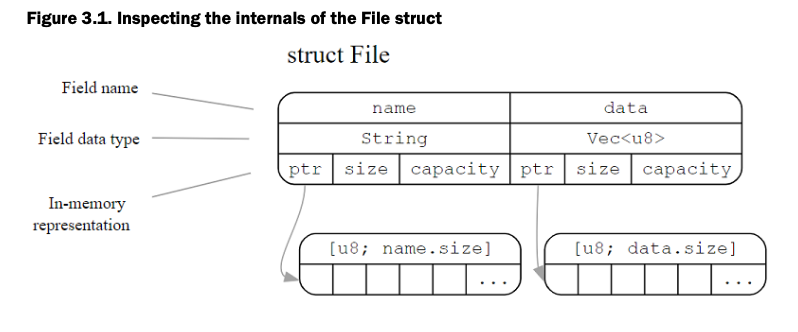
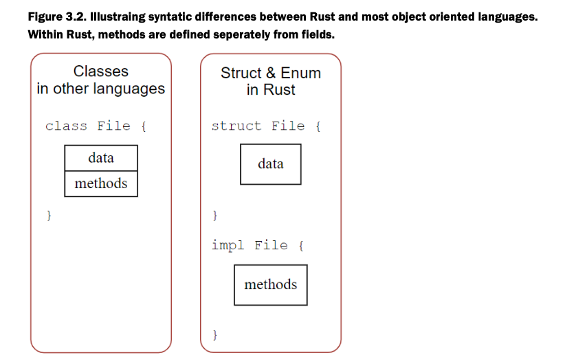
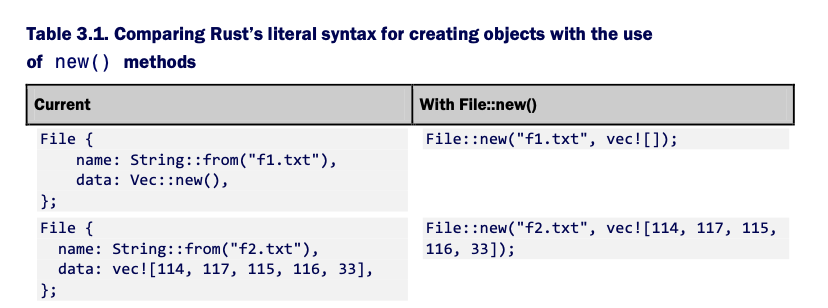
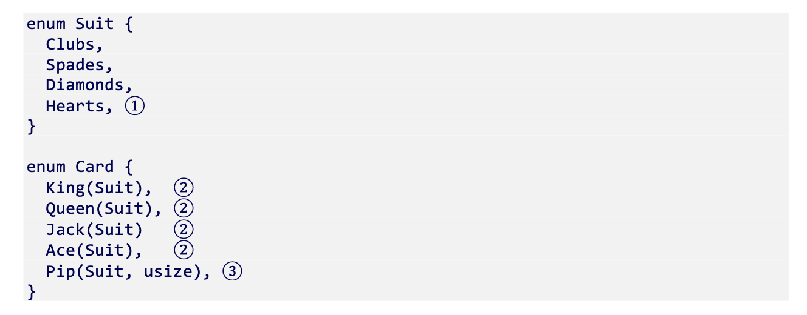

# Ch 3 Compound Data Types

This chapter focuses on two key building blocks, **struct and enum**. It also discusses **impl blocks** (that are used to add methods to data) as well as its interface/protocol system: **traits**. 

The driving code example for this chapter will be trying to represent files in code. We will first start off by trying to use just functions.

#![allow(unused_variables)]//relax compiler warnings

typeFile=String;//create type alias

fnopen(f: &mutFile) ->bool{

    true//assume these functions succeeds

}

fnclose(f: &mutFile) ->bool{

    true

}

#[allow(dead_code)]//relaxes compiler warnings

fnread(f: &mutFile, save_to: &mutVec<[u8]>) -> ! {//Using ! as return type indicates to the Compiler that this function never returns

    unimplemented!()// A macro that crashes the program if it is encountered

}

fnmain() {

    letmutf1 = File::from("f1.txt");//With the type declaration on line 3, File inherits String methods

    open(&mutf1);

    //read(f1, vec![]);

    close(&mutf1);

}

Okay, what is even the point here? We haven't created a persistent object that could represent a file (there's only so much that can be encoded in a string)/ There was no attempt to implement a read function. Open and close return bool. None of our functions are methods. 

**Structs**

#[derive(Debug)]// Allows the println! macro to print File

structFile{

    name:String,

    data:Vec<u8>,//Using Vec<u8> provides access to some useful conveniences such as writing to a file

}

fnmain() {

    letf1 = File {

        name:String::from("f1.txt"),        

        data:Vec::new(),

    };

    letf1_name = &f1.name;

    letf1_length = &f1.data.len();

    println!("{:?}", f1);

    println!("{} is {} bytes long", f1_name, f1_length);

}

Lines 1-5 define the File struct. **Definitions include fields and their associated types**. They **also include each field's lifetimes**, which is avoided here. Explicit lifetimes are required when a field is a reference to another object. 

Structs fields can be accessed using the dot operator. We add an & to indicate that we wish to access this data by reference. In Rust parlance, this means that the variables f1_name and f1_length are borrowing the data they are referred to. This means following the pointer to memory.

Let's use this struct in our file example now.

#![allow(unused_variables)]//Silences the warnings caused by open and close

#[derive(Debug)]// Enables file to work with printlnl! and its fmt! siblings

structFile{

    name:String,

    data:Vec<u8>,//Using Vec<u8> provides access to some useful conveniences such as writing to a file

}

fnopen(f: &mutFile) ->bool{

    true

}

fnclose(f: &mutFile) ->bool{

    true

}

fnread(f: &File, save_to: &mutVec<u8>) ->usize{//return number of bytes read

    letmuttmp = f.data.clone();//make a copy of the data here

    letread_length = tmp.len();

    save_to.reserve(read_length);//not necessary but usefulto know about. Ensures there is sufficient space to fit theincoming data

    save_to.append(&muttmp);// allocate sufficent data in the save_to buffer to hold the contents of f

    returnread_length;

}

fnmain() {

    letmutf2 = File {    

        name:String::from("2.txt"),

        data:vec![114,117,115,116,33],

    };

    letmutbuffer:Vec<u8> =vec![];

    open(&mutf2);

    letf2_length =read(&f2, &mutbuffer);

    close(&mutf2);

    lettext =String::from_utf8_lossy(&buffer);//converts Vec<u8> to String

    println!("{:?}", f2);

    println!("{} is {} bytes long", &f2.name, &f2_length);

    println!("{}", text);

}

Sweet, now we can read! Let's move onto adding methods to structs.

**Adding methods to struct with impl**

**Methods are functions that are coupled to some object**. From a syntactic perspective, they're just functions that don't need to specify one of their arguments.

In Rust there is no class keyword, it's struct and enum types can both feel like classes at times, but they don't support inheritance.

**To define methods, Rust programmers use an impl block** that is physically distinct in source code from the struct blocks. 

Creating objects with reasonable defaults is done through the new method. Every struct can be instantiated through literal syntax though. 

**Using new() is a convention** within the Rust community. Unlike other languages, **new is not a keyword**. 

#![allow(unused_variables)]//Silences the warnings caused by open and close

#[derive(Debug)]// Enables file to work with printlnl! and its fmt! siblings

structFile{

    name:String,

    data:Vec<u8>,//Using Vec<u8> provides access to some useful conveniences such as writing to a file

}

implFile{

    fnnew(name: &str) -> File {

        File {

            name:String::from(name),

            data:Vec::new(),

        }

    }

    fnnew_with_data(name: &str, data: &Vec<u8>) -> File {

        letmutf = File::new(name);

        f.data = data.clone();

        returnf;

    }

    fnread(self: &File, save_to: &mutVec<u8>) ->usize{//return number of bytes read

        letmuttmp =self.data.clone();//make a copy of the data here

        letread_length = tmp.len();

        save_to.reserve(read_length);//not necessary but usefulto know about. Ensures there is sufficient space to fit theincoming data

        save_to.append(&muttmp);// allocate sufficent data in the save_to buffer to hold the contents of f

        returnread_length;

    }

}

fnopen(f: &mutFile) ->bool{

    true

}

fnclose(f: &mutFile) ->bool{

    true

}

fnmain() {

    letf3_data:Vec<u8> =vec![114,117,115,116,33];

    letmutf3 = File::new_with_data("2.txt", &f3_data);

    letmutbuffer:Vec<u8> =vec![];

    open(&mutf3);

    letf3_length = &f3.read(&mutbuffer);

    close(&mutf3);

    lettext =String::from_utf8_lossy(&buffer);//converts Vec<u8> to String

    println!("{:?}", f3);

    println!("{} is {} bytes long", &f3.name, f3_length);

    println!("{}", text);

}

**Returning Errors**

Early on in the chapter, two points were raised discussing dissatisfaction with being unable to properly signify errors. **The issue arises because dealing with hardware is unreliable**. Even ignoring hardware faults, the disk may be full or the operating system may intervene and tell you that you don't have permission to delete a particular file. This section discusses different methods of signaling that an error has occurred.

**Modifying a known global variable**

One of the **simplest methods** for signaling that an error has occurred is by checking the value of a global variable. This strategy is notoriously error prone, yet it is still a common idiom.

C programmers are used to checking the value of errno once system calls have returned. As an example, the close() system call closes a file descriptor, with numbers being relative to individual processes and errno may be modified by this cal. This means setting errno to a magical constant that is arbitrary and defined by the operating system.

In Rust, checking a global variable would look like this. 

staticmutERROR:i32=0;// a global variable that is valid for the life of the program

// ...

fnmain() {

//...

    read(f, buffer)

    unsafe{//accessing and modifying static mut variables requires using the unsafe block. This is Rut's way of disclaiming resposibility

        ifERROR !=0{

            panic!("An error has occurred")

        }

    }

}

The unsafe block means the same level of safety offered by C. It is a warning sign that the behavior you are using can be dangerous. 

This **style of programming would typically be discouraged **in Rust as it **omits** both **type safety **(errors are encoded as plain integers) and can reward sloppy programmers with **unstable programs **when they forget to check the errno value.

However! It is an **important style** to be aware of because **Systems programmers need to interact with operating system-defined global value**s and software that interacts with CPU registers and other low-level hardware will need to get used to inspecting flags to check that operations were completed successfully.

**Using the Result return type**

Rust's approach to error handling is to** use a type that stands for both the standard and the error case**. This type is known as **Result**. Result has two states, Ok and Err. 

When we call the functions that return a result, there is now an additional call to unwrap(), which unwraps Ok(T) and produces T. 

externcraterand;//bring rand crate into scope

userand::Rng;//bring random number generator trait into scope

fnone_in(n:u32) ->bool{

    returnrand::thread_rng().gen_weighted_bool(n);//helper function to trigger sporadic errors

}

#[derive(Debug)]// Enables file to work with printlnl! and its fmt! siblings

structFile{

    name:String,

    data:Vec<u8>,//Using Vec<u8> provides access to some useful conveniences such as writing to a file

}

implFile{

    fnnew(name: &str) -> File {

        File {

            name:String::from(name),

            data:Vec::new(),

            }

    }

    fnnew_with_data(name: &str, data: &Vec<u8>) -> File {

        letmutf = File::new(name);

        f.data = data.clone();

        returnf;

    }

    fnread(self: &File, save_to: &mutVec<u8>) ->Result<usize,String> {//return number of bytes read

        letmuttmp =self.data.clone();//make a copy of the data here

        letread_length = tmp.len();

        save_to.reserve(read_length);//not necessary but usefulto know about. Ensures there is sufficient space to fit theincoming data

        save_to.append(&muttmp);// allocate sufficent data in the save_to buffer to hold the contents of f

        Ok(read_length)

    }

}

fnopen(f: File) ->Result<File,String> {

    ifone_in(10_000) {

        leterr_msg =String::from("Permission denied");

        returnErr(err_msg);

    }

    Ok(f)

}

fnclose(f: File) ->Result<File,String> {

    ifone_in(100_000) {

        leterr_msg =String::from("Interrupted by signal");

        returnErr(err_msg);

    }

    Ok(f)

}

fnmain() {

    letf4_data:Vec<u8> =vec![114,117,115,116,33];

    letmutf4 = File::new_with_data("4.txt", &f4_data);

    letmutbuffer:Vec<u8> =vec![];

    f4 =open(f4).unwrap();

    letf4_length = f4.read(&mutbuffer).unwrap();

    f4 =close(f4).unwrap();

    lettext =String::from_utf8_lossy(&buffer);//converts Vec<u8> to String

    println!("{:?}", f4);

    println!("{} is {} bytes long", &f4.name, f4_length);

    println!("{}", text);

}

Just a note,** calling Result.unwrap() is often considered poor style**, it effectively ignores the possibility of an error.

Open and close now take full ownership of their File arguments. This enables the File argument to be inserted into Ok(T) as T is returned. Associated with this change is that the variable f4 is now rebound multiple times with the result of the function calls.

When Err(e) is returned, the whole program shuts down. **Using Result provides use with compiler-assisted code correctness**: the code won't compile unless we've taken the time to handle the edge cases.

So, what is a Result? **Result is an enum defined in Rust's standard library**. It has the same status as any other type, but is tied together with the rest of the language through community conventions.

**Enums**

**

**

An** enum** (enumeration) is **a type that can represent multiple known variants**. 

#[derive(Debug)]

enumEvent{

Update,

Delete,

Unknown,

}

typeMessage=String;

fnparse_log(line: &'staticstr) -> (Event, Message) {// a function for parsing a line and returning semi-structured data

letparts:Vec<&str> = line.splitn(2,' ').collect();//collect assumes an iterator (returned from splitn())

ifparts.len() ==1{

return(Event::Unknown,String::from(line))

}

letevent = parts[0];

letrest =String::from(parts[1]);

matchevent {

"UPDATE"|"update"=> (Event::Update, rest),

"DELETE"|"delete"=> (Event::Delete, rest),

_ => (Event::Unknown,String::from(line)),

}

}

fnmain() {

letlog ="BEGIN Transaction XK342

UPDATE 234:LS/32231 {\"price\": 31.00} -> {\"price\": 40.00}

DELETE 342:LO/22111";

forlineinlog.lines() {

letparse_result =parse_log(line);

println!("{:?}", parse_result)

}

}

Enums have a few tricks up their sleeves. They work with Rust's pattern matching capabilities to help you build robust, readable code. Like structs, they support methods via Impl blocks, and they are more powerful than a set of constants because it is possible to include data within variants, granting them struct-like behavior.

Now that we have seen how to define and use an enum, let's apply it to our file class. We will expand our File type and allow it to change as it is opened and closed.

#[derive(Debug, PartialEq)]

enumFileState{

Open,

Closed,

}

#[derive(Debug)]// Enables file to work with printlnl! and its fmt! siblings

structFile{

name:String,

data:Vec<u8>,

state: FileState,

}

implFile{

fnnew(name: &str) -> File {

File {

name:String::from(name),

data:Vec::new(),

state: FileState::Closed

}

}

fnread(self: &File, save_to: &mutVec<u8>) ->Result<usize,String> {//return number of bytes read

ifself.state != FileState::Open {

returnErr(String::from("File must be open for reading"));

}

letmuttmp =self.data.clone();//make a copy of the data here

letread_length = tmp.len();

save_to.reserve(read_length);//not necessary but usefulto know about. Ensures there is sufficient space to fit theincoming data

save_to.append(&muttmp);// allocate sufficent data in the save_to buffer to hold the contents of f

Ok(read_length)

}

}

fnopen(mutf: File) ->Result<File,String> {

f.state = FileState::Open;

Ok(f)

}

fnclose(mutf: File) ->Result<File,String> {

f.state = FileState::Closed;

Ok(f)

}

fnmain() {

letmutf5 = File::new("5.txt");

letmutbuffer:Vec<u8> =vec![];

iff5.read(&mutbuffer).is_err() {

println!("Error checking is working");

}

f5 =open(f5).unwrap();

letf5_length = f5.read(&mutbuffer).unwrap();

f5 =close(f5).unwrap();

lettext =String::from_utf8_lossy(&buffer);//converts Vec<u8> to String

println!("{:?}", f5);

println!("{} is {} bytes long", &f5.name, f5_length);

println!("{}", text);

}

**Defining common behavior with Traits**

**

**

A robust definition of the term "file" needs to be agnostic to storage medium. Files at the least support reading and writing. Focusing on these two capabilities allows us to ignore where the reads and writes are actually taking place. They could be from a hard drive, an in-memory cache, over a network, or something exotic.

**Traits in Rust are often named interfaces** in other languages (I'm thinking Go here). They **define rules that say, to call yourself X you must implement Y.**

So you've actually seen traits in action several times. Every time we've used #[derive(Debug)] in a type definition, we've implemented the Debug trait for that type. Traits permeate the Rust language.

Let's create a Read trait for our file type.

**Traits enable the compiler and other humans to know that multiple types are attempting to perform the same task**. Types that use #[derive(Debug)] are all able to be printed to the console via the println! macro and its relatives. Allowing multiple types to implement a Read trait enables code re-use. 

#![allow(unused_variables)]//silence any warnings to unused variables

#[derive(Debug)]

structFile;

traitRead{//a trait block includes the type signatures of functions that implementors must comply with

fnread(self: &Self, save_to: &mutVec<u8>) ->Result<usize,String>;

}

implReadforFile{ //impl block attaches a trait to a type

fnread(self: &File, save_to: &mutVec<u8>) ->Result<usize,String> {

Ok(0)

}

}

fnmain() {

letf = File{};

letmutbuffer =vec!();

letn_bytes = f.read(&mutbuffer).unwrap();

println!("{} byte(s) read from {:?}", n_bytes, f);

}

println! and a number of others live within a family of macros that all use the same underlying machinery. They rely on the Display and Debug traits. Look at the println! above. The Debug trait relies on the ? to work.

It's possible to rely on the Debug trait as a crutch, but what should you do if you want to provide a custom printed message? If you look through the Docs, you will see that Display requires types to implement a fmt method that returns a fmt::Result. 

**Exposing Types to the World**

**

**

Your crates will interact with others you build over time. You may wish to make that process easier for your future self by hiding internal details and documenting what is public. This section describes some of the tooling available within the language. 

**Rust defaults to keeping things private**. If you were to create4 a library with only the code you've seen so far, importing your crate would provide no extra benefit. To remedy this, use the **pub keyword**.

**Creating In-line Documentation**

**

**

When software becomes larger, it becomes more important to document one's progress. 

Using //! and /// comments will allow for the creation of documentation.

**cargo doc --open**
