# Ch 4 Lifetimes, Ownership and Borrowing

Rust's **borrow checker** checks that all **access to data is legal**. This prevents safety issues.

**Borrow checking relies** on three inter-related concepts: l**ifetimes, ownership and borrowing**.  

1. **Ownership**
2. A value's 
3. To

The strategy for this chapter will be to code an example that compiles, then make a minor change that will trigger an error that appears to emerge without any adjustment of the program's flow. Working through the fixes will demonstrate these concepts!

The example will be using a CubeSat constellation.

#![allow(unused_variables)]

#[derive(Debug)]

enumStatusMessage{

Ok,

}

fncheck_status(sat_id:u64) -> StatusMessage {

StatusMessage::Ok

}

fnmain() {

letsat_a =0;

letsat_b =1;

letsat_c =2;

leta_status =check_status(sat_a);

letb_status =check_status(sat_b);

letc_status =check_status(sat_c);

println!("a: {:?}, b: {:?}, c: {:?}", a_status, b_status, c_status);

// "waiting" ...

leta_status =check_status(sat_a);

letb_status =check_status(sat_b);

letc_status =check_status(sat_c);

println!("a: {:?}, b: {:?}, c: {:?}", a_status, b_status, c_status);

}

Let's move closer to idiomatic Rust by introducing type safety. Instead of integers, let's create a type to model our satellites. 

#[derive(Debug)]

structCubeSat{

id:u64,

}

#[derive(Debug)]

enumStatusMessage{

Ok,

}

fncheck_status(sat_id: CubeSat) -> StatusMessage {

StatusMessage::Ok

}

fnmain() {

letsat_a = CubeSat { id:0};

letsat_b = CubeSat { id:1};

letsat_c = CubeSat { id:2};

leta_status =check_status(sat_a);

letb_status =check_status(sat_b);

letc_status =check_status(sat_c);

println!("a: {:?}, b: {:?}, c: {:?}", a_status, b_status, c_status);

// "waiting" ...

leta_status =check_status(sat_a);

letb_status =check_status(sat_b);

letc_status =check_status(sat_c);

println!("a: {:?}, b: {:?}, c: {:?}", a_status, b_status, c_status);

}

When we attempt to compile the code, we will receive a message similar to the following.

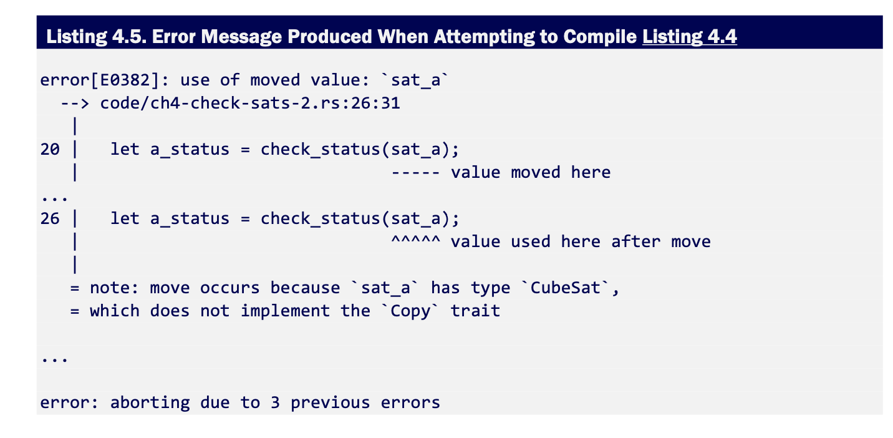

The compiler says that we are using a "moved" value and are fully advised to implement the Copy trait on CubeSat. What?!

**Movement** within Rust code **refers to movement of ownership**, rather than movement of data. **Ownership** is a term used within the Rust community to **refer to the compile-time process that checks that every use of a value is valid and that every value will be destroyed cleanly.**

**Every value in Rust is owned**. sat_a, sat_b, and sat_c own the data that they refer to. **When calls to check_status are made, ownership of the data moves from the variables in the scope of main() to the sat_id variable within the function**. The significant difference is that the above code places the integer within a CubeSat struct. This type change alters the semantics of the how the program behaves.

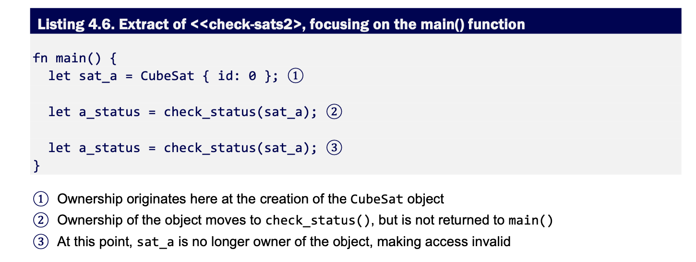

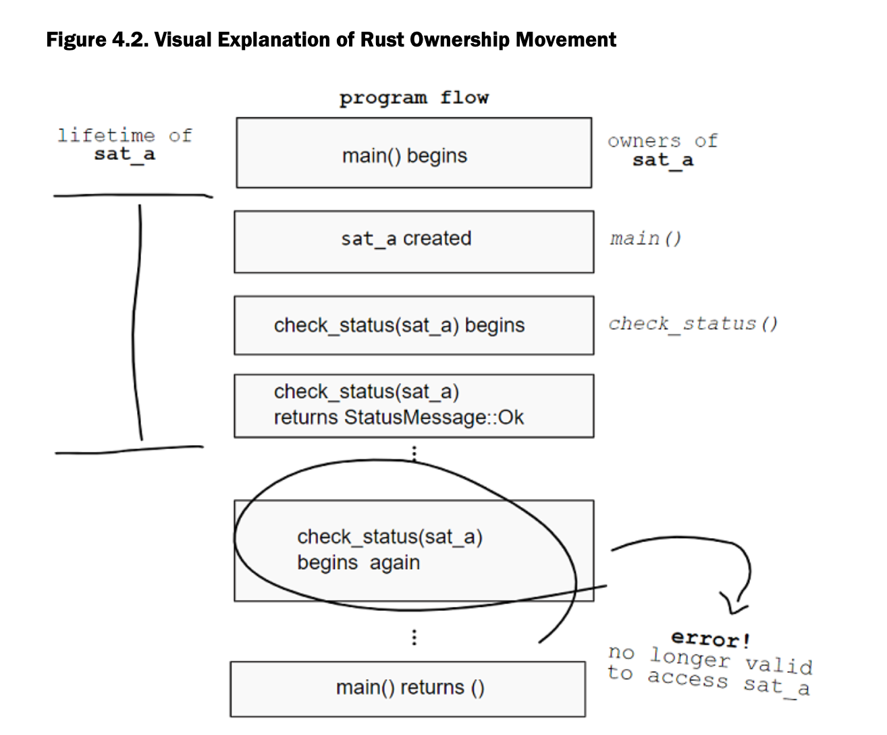

1. During the call to check_status(sat_a), ownership moves to the check_status function. 
2. When check_status() returns a StatusMessage, it drops the sat_a value. The lifetime of sat_a ends here. 
3. Yet sat_a remains in the local_scope of main after the first call to status_check

The **distinction between a value's lifetime ands its scope** can make things difficult to disentangle. Avoiding and overcoming this type of issue makes up the bulk of the chapter.

So why did the first code snippet compile at all? As it happens, **primitive types in Rust have special behavior.** They implement the Copy trait.

Primitive types possess copy semantics, whereas **all other types have move semantics**. 

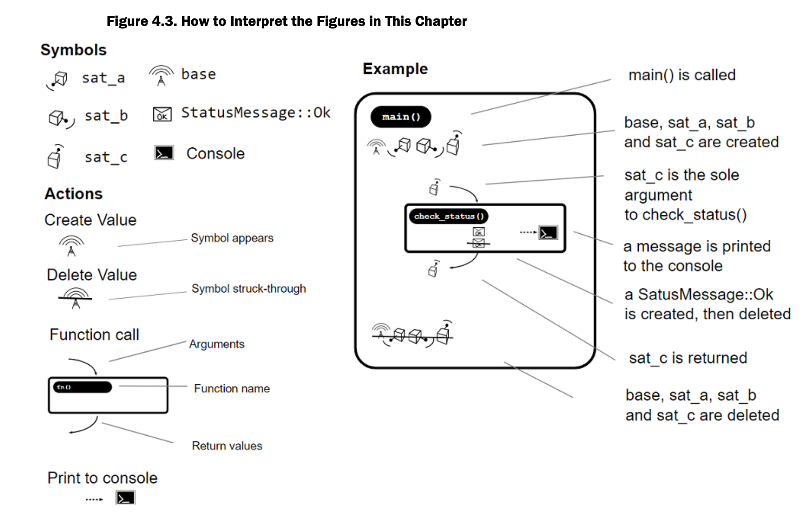

**What is an Owner? Does it have any responsibilities?**

**

**

In the world of Rust, the notion of **ownership is limited**: **An owner cleans up when its values' lifetimes end**. 

When **values go out of scope or their lifetimes end** for some other reason, their **destructors are called**. A destructor is **a function that removes traces of the value from the program by deleting references and freeing memory**. You won't find a call to any destructors in most Rust code. The compiler injects that code itself. 

To provide a custom destructor for a type, implement Drop. This will typically be needed in cases where you have used unsafe blocks to allocate memory.

An implication of this system is that values may not outlive their owner. Also **owners do not have special access **to their owned data, nor do they have the ability to restrict others from trespassing. 

**How Ownership Moves**

**

**

There are two main ways to shift ownership from one variable to another within a Rust program. 

1. The first is through 
2. The second is by

Revisiting our original code, we can see that sat_a starts its life with ownership over the CubeSat object.

The CubeSat object is then passed into check_status as an argument, moving ownership to the local variable sat_id. There are a couple of ways we could have fixed this. 

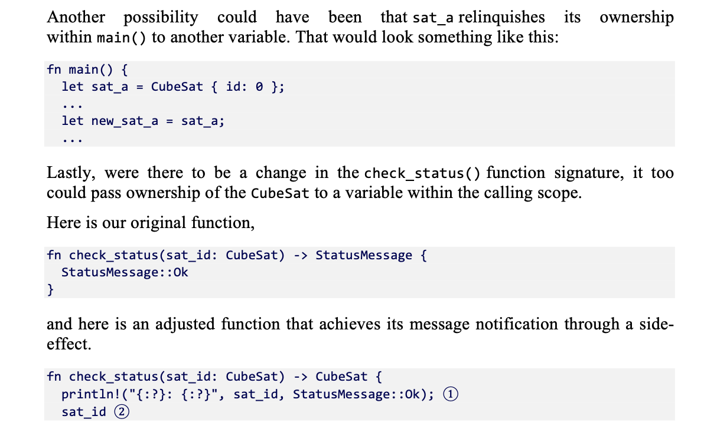

Let's adjust the code by pushing the responsibility of printing each satellite into the check_status function. This way we can use assignment to hand the ownership back to main.

#[derive(Debug)]

structCubeSat{

id:u64,

}

#[derive(Debug)]

enumStatusMessage{

Ok,

}

fncheck_status(sat_id: CubeSat) -> CubeSat {

println!("{:?}: {:?}", sat_id, StatusMessage::Ok);

returnsat_id;

}

fnmain() {

letsat_a = CubeSat { id:0};

letsat_b = CubeSat { id:1};

letsat_c = CubeSat { id:2};

letsat_a =check_status(sat_a);

letsat_b =check_status(sat_b);

letsat_c =check_status(sat_c);

// "waiting" ...

letsat_a =check_status(sat_a);

letsat_b =check_status(sat_b);

letsat_c =check_status(sat_c);

}

Now that the return value of check_status is the original CubeSat object, the new let binding is reset. 

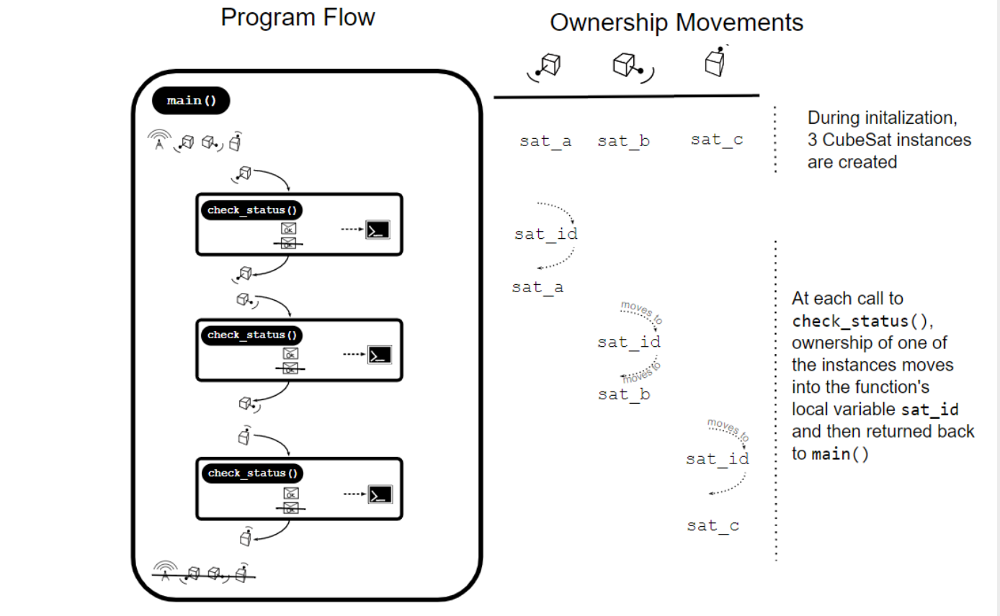

**Resolving Ownership Issues**

**

**

Rust's ownership system provides **a route to memory safety without needing a garbage collector**. However, the o**wnership system can trip you up** if you don't understand what is happening. 

Four general strategies to help with ownership issues are:

1. Use references where full ownership is not required
2. Duplicate the value
3. Refactoring code to reduce the number of long-lived objects
4. Wrap your data in a type designed to assist with movement issues

Let's examine these strategies by extending the capabilities of our satellite network. Let's give the ground station and our satellites the ability to send and receive messages.

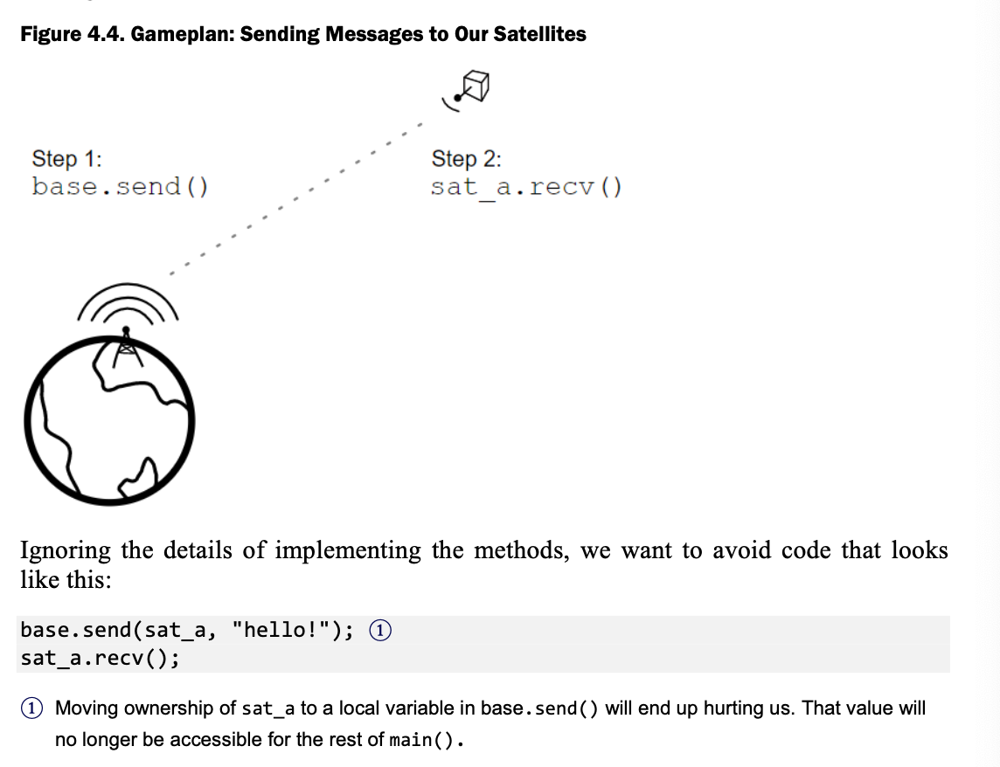

The** most common change you will make to your code is to reduce the level of access you require**. Instead of requesting ownership, **use a borrow** in your function definitions. 

1. For read-only access, use &T. 
2. For read/write access. use &mut T.

Okay, but what does this look like in code?

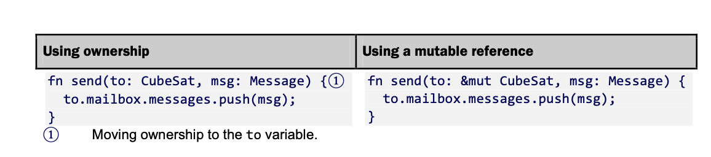

Sending messages will eventually be wrapped up in a method, but in essence functions implementing it must modify the internal mailbox of CubeSat.

implGroundStation{

fnsend(&self, to: &mutCubeSat, msg: Message) {//&self indicates that GroundStation.send() only requires a read-only reference to self

to.mailbox.messages.push(msg);

}

}

implCubeSat{

fnrecv(&mutself) ->Option<Message> {

self.mailbox.messages.pop();

}

}

Notice that. both GroundStation.send() and CubeSat.recv() require mutable access to a CubeSat instance, as both methods are modifying the underlying CubeSat.messages vector. 

**We move ownership of the message** that we are sending into messages.push(). This will provide us with some quality assurance later, notifying us if we were to access a message after it has already been sent. 

fnmain() {

letbase = GroundStation {};

letmutsat_a = CubeSat { id:0, mailbox: Mailbox { messages:vec![] }};

println!("t0: {:?}", sat_a);

base.send(&mutsat_a, Message::from("hello there!"));// We don't have an ergonomic way to make messages yet, so we will use the String function from

println!("t1: {:?}", sat_a);

letmsg = sat_a.recv();

println!("t2: {:?}", sat_a);

println!("msg: {:?}", msg);

}

**Use Fewer Long-Lived Values**

**

**

If we have a large, long-standing object such as a global variable, it can be somewhat unwieldy to keep this around for every component of our program that needs it. Another useful Rust technique is to consider making objects that are more discrete and ephemeral. 

To implement this kind of strategy, we will create a function that returns CubeSat identifiers. That function is assumed to be a black box that's responsible for communicating with some store of identifiers, such as a database. 

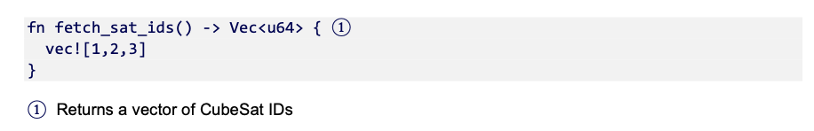

Whenever we need to communicate with a satellite, we'll create a new object. In this way, there is no requirement for us to maintain live objects for the whole of the program's duration. It also has the dual benefit that we can afford to transfer ownership of our short-lived variables to other functions. 

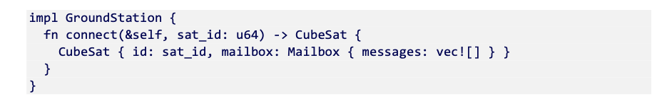

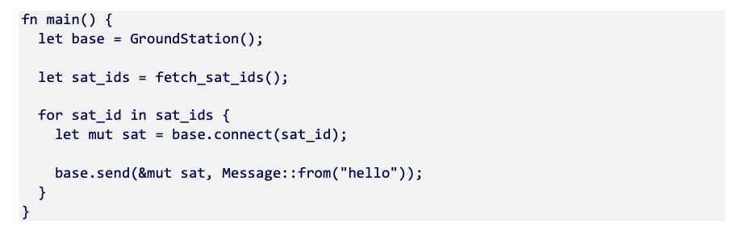

There's a problem with the above code. Our CubeSat instances die at the end of the for loop's scope. Along with any messages that base sends them. **To carry our design decision of short-lived variables, the messages need to live somewhere outside the CubeSat instances**. 

In a real system they would live on the RAM of the satellite. In our simulator, we will put them in a buffer object that lives for the duration of our program. 

Our message store will be a Vec<Message>, aka our Mailbox type that we defined in one of the first code examples of this chapter. We'll change the Message struct to add a sender and recipient field.  That way our CubeSat instances can match against their id to receive messages. 

If this is the case, we will need to re-implement the sending and receiving of messages. In the modification below, the Mailbox instance is given the ability to modify its own messages vector. When any of the satellites transmit messages, they take a mutable borrow to the mailbox. 

#![allow(unused_variables)]

#[derive(Debug)]

structCubeSat{

id:u64,

}

#[derive(Debug)]

structMailbox{

messages:Vec<Message>,

}

#[derive(Debug)]

structMessage{

to:u64,

content:String,

}

structGroundStation;

implMailbox{

fnpost(&mutself, msg: Message) {

self.messages.push(msg);

}

fndeliver(&mutself, recipient: &CubeSat) ->Option<Message> {

foriin0..self.messages.len() {

ifself.messages[i].to == [recipient.id](http://recipient.id) {

letmsg =self.messages.remove(i);

returnSome(msg);

}

}

None

}

}

implGroundStation{

fnconnect(&self, sat_id:u64) -> CubeSat {

CubeSat {

id: sat_id,

}

}

fnsend(&self, mailbox: &mutMailbox, msg: Message) {//&self indicates that GroundStation.send() only requires a read-only reference to self

mailbox.post(msg);

}

}

implCubeSat{

fnrecv(&self, mailbox: &mutMailbox) ->Option<Message> {

mailbox.deliver(&self)

}

}

fnfetch_sat_ids() ->Vec<u64> {

vec![1,2,3]

}

fnmain() {

letmutmail = Mailbox { messages:vec![] };

letbase = GroundStation {};

letsat_ids =fetch_sat_ids();

forsat_idinsat_ids {

letsat = base.connect(sat_id);

letmsg = Message { to: sat_id, content:String::from("hello!")};

base.send(&mutmail, msg);

}

letsat_ids =fetch_sat_ids();

forsat_idinsat_ids {

letsat = base.connect(sat_id);

letmsg = sat.recv(&mutmail);

println!("{:?}: {:?}", sat, msg);

}

}

**Duplicating the Value**

**

**

Having a single owner for every object can mean significant up-front planning and/or refactoring of your software. As we saw in the last refactor, that can take a lot of redesign.

**One alternative to refactoring is to simply copy values**. Doing this often is typically frowned upon, but it can be useful in a pinch. We saw this earlier with primitive types. 

**Types can opt into two modes of being copied**: Clone and Copy. 

1. Copy acts implicitly whenever ownership would otherwise be moved.
2. Clone acts explicitly.

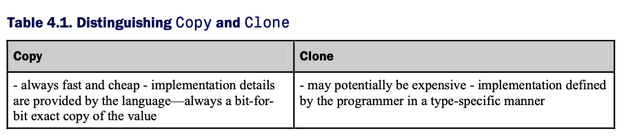

To use Copy, you need to have types that themselves implement Copy.

#[derive(Debug, Clone, Copy)]//import copy and clone for struct

structCubeSat{

id:u64,

}

#[derive(Debug, Clone, Copy)]

enumStatusMessage{

Ok,

}

fncheck_status(_sat_id: CubeSat) -> StatusMessage {

StatusMessage::Ok

}

fnmain() {

letsat_a = CubeSat { id:0};

leta_status =check_status(sat_a.clone());

println!("a: {:?}", a_status.clone());

// "waiting" ...

// these two calls use copy

leta_status =check_status(sat_a);

println!("a: {:?}", a_status);

}

**Wrap Data within specialty types**

**

**

A final strategy that is quite often used is to use a "wrapper" type that presents a facade to the outside world of move semantics, but actually are doing something special under the hood.

Rust allows programmers to opt-in to runtime garbage collection. This is enabled via **reference-counting**. With reference counting,  each reference-counting object increments an internal counter when they are cloned, they decrement when they are Dropped. When the internal counter reaches zero the original instance is freed.
