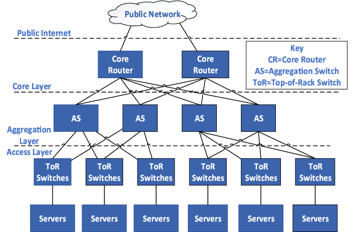
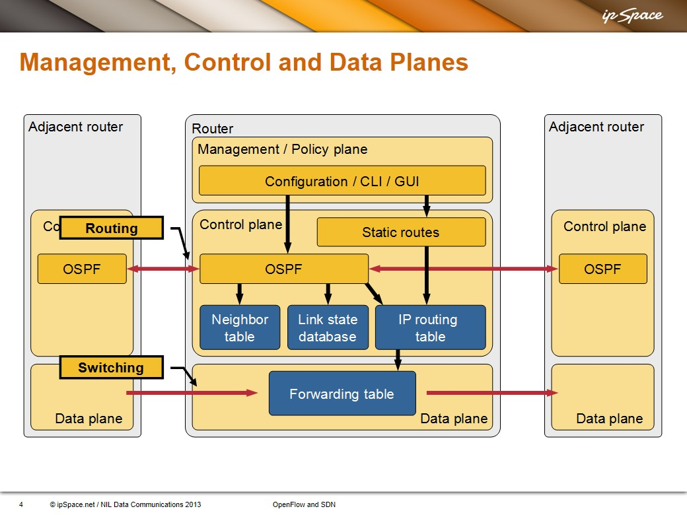
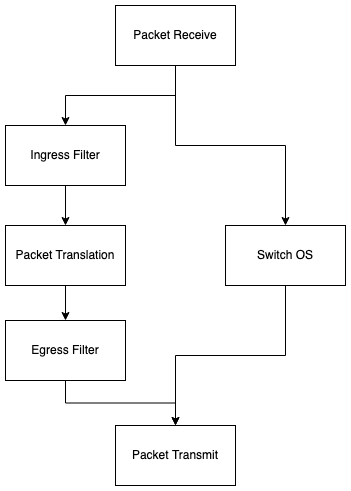

# Introduction to Software Defined Networks

## Table of Contents
* [Introduction](#introduction)
* [Terminology](#terminology)
* [Modern Data Centers](#modern-data-centers)
* [Traditional Switch Architecture](#traditional-switch-architecture)

## Introduction

**Software Defined Networking** (SDN) is a novel **way to program the switches utilized in modern data networks**. It is a move towards centralized network control architecture, and it is well suited to large networks prevalent at data centers.

## Terminology

The **Data Link Layer** is the second lowest layer of the OSI model (behind the physical layer). This layer **provides the capability to transfer data from one device to another on a single network segment**. The link layer includes
    1. mechanisms to detect sequencing errors or bit errors that might occur during transmission.
    2. mechanisms for flow control between the sender and receiver across the network segment.
    3. a multiplexing ability to allow multiple network protocol to use the same communication medium.
These three functions are considered to be part of the **logical link control component** of the data link layer. The remaining functions of the data link layer are part of the **media access control component** **(MAC)**. The MAC layer is the part of the data link layer that **controls when a shared medium may be accessed and provides addressing** in the case that multiple receivers will receive the data yet only one should process it.

The **Network Layer** provides the **functions and processes that allow data to be transmitted from sender to receiver across multiple intermediate networks**. To transit each intermediate network involves the data link layer processes described above.

A **switch** is a **device that receives information on one of its ports and transmits that information out one or more of its other ports**. Switches come in two flavors:
    1. A **circuit switch** is a switch where contextual **information specifying where to forward the data belonging to a circuit is maintained** in the switch for a prescribed duration. This context is established either by configuration or by a call/connectionn set-up specific to the type of search.
    2. A **packet switch** is a switch where the **data comprising the communication between two or more entities is treated as individual packets that each make their way independently** through the network toward the destination. Packet switches can be **connection-oriented or connectionless**.
        1. In a **connection-oriented model**, there is some context information residing in intermediate switches that allows the switch to forward the data to its destination.
        2. In a **connectionless model** there is sufficient data within a packet such that each intermediate switch can forward the data toward its destination without any context have been established about that data.

A **router** is **a packet switch used to separate subnets**. A subnet is a network consisting of a set of hosts that share the same network prefix. A network prefix consists of the most significant bits of the IP address. A prefix may be of varying length. Usually all the hosts on a subnet reside on the same LAN>

The term **line rate** refers to the **bandwidth** of the communication medium connected to a port on a switch. When we say that a switch handles packets at line rate, this means it is capable of handling a continuous stream of packets arriving on that part at that bandwidth.

## Modern Data Centers

Data centers are the organizational unit used to serve high volumes of traffic. They are composed of a very large number of servers arranged into organized rows of racks of servers. 

Over time, the demand for efficiency drove the migration of individual server computers into server blades, a stripped down server with a modular design optimized to minimize the use of physical space and energy. Racks of **blades are connected by Top-of-Rack switches**.

Physical servers an conceivably host twenty virtual machines. With a data center of 100,000 servers, this can mean an internal network of 2,000,000 hosts!

So, let's paint a picture. In a traditionally-designed data center there are a large number of host computers that all communicate with each other via a set of communication protocols and networking devices designed to work over a large, disparate geographical area with unreliable communications. This isn't very efficient. 

The environment in a data center is much more stable than the world imagined when first developing networking technology.

Studies indicate that the majority of traffic in current data centers is **East-West traffic** (**traffic composed of packets sent from one host inside the data center to another host in the same data center**).

The protocols designed to achieve robustness in the geographically wide-dispersed Internet require that routers spend more than thirty percent of their CPU cycles rediscovering and recalculating routes for a network topology in a highly static data center.

## Traditional Switch Architecture

The various switching functions of a traditional switch are separated into three separate categories: **control, management, and data planes**. 

The **vast majority of packets handled by the switch are by the data plane**. The **data plane consists of the various ports that are used for the reception and transmission of packets** and a **forwarding table** with its associated logic. The data plane assumes responsibility for **packet buffering, packet scheduling, header modification, and forwarding**. If an arriving packet's header is found in the forwarding table it will be subject to some header modification and then forwarded out without the intervention of the other planes.

Not all packets can be handled this way. Sometimes this is simply because their information is not yet entered into the table, or because they belong to a control protocol that must be processed by the control plane.

The **control plane's principal role is to keep current the information in the forwarding table** so that the data plane can independently handle as high a percentage of traffic as possible. The control plane is **responsible for processing a number of different control protocols** that may affect the forwarding table. 

These protocol are sufficiently complex to use general purpose microprocessors and accompanying software in the control plane, whereas the **data plane logic can be crafted entirely in silicon**.

Network administrators configure and monitor the switch through the management plane, which in turn extracts information or modifies data in the control and data planes as appropriate.

### Software-based Routing and Bridging

Back in the good ol' days most routers were just general purpose Unix computers running software that inspected a packet that arrived on one interface and looked up the destination IP address in some efficiently searched data type like a tree or a hash. This data structure was called the **routing table**. Based on the entry found in the routing table, the packet would be transmitted on the indicated outbound interface.

Demand for increased speed led to improvements in media speed, which in turn made it necessary to increase the speed of the router and bridge platforms. This led to the development of hardware lookup.

### Hardware Look-up Forwarding Tables

The first major use of hardware acceleration in packet switching was via the use of **Application Specific Integrated Circuits (ASICs)** to perform **high-speed hashing functions** for table look-ups. ASICs are integrated circuits customized for a particular use.

In the middle 1990's, advances in **Content Addressable Memory (CAM)** made it possible to perform very high speed lookups using destination address fields to find the output interface for high speed packet forwarding.

Unlike RAM, in which the user supplies a memory address and the RAM returns the data word stored at that address, a **CAM is designed such that the user supplies a data word and the CAM searches its entire memory to see if that data word is stored anywhere**. If the data word is found, it returns a last of storage addresses where the word was found. It is the hardware embodiment of a hash table/associative array. CAMs are used at both layer 2 and layer 3. Layer three address lookup is just more complicated sincne the devices look up the closest match. This means they need to use ternary content addressable memory which allows the use of a mask.

### Generically Programmable Forwarding Rules

In reality there are many packets the need to be processed by a switch that need more complicated treatment than simply being forwarded on another interface different than the one that it has arrive on. For example, the packets that belong to control protocols need to be processed by the control plane.

With the pressure to keep processing time fast, the idea of **programmable rules** came about. Programmable rules encode complex processing into rules that could be carried out by the forwarding engine. This allowed switches to implement more complex protocols at increasing line rates.

The figure above shows the major functional blocks that a packet will transit as it is being forwarded by the switch. 

1. Packet Receive - Create flow key for lookup in forward DB. 
2. Ingress Filter - Apply inbound policy (discard certain packets, etc.)
3. Packet Translation - Process address information and tags, rewriting the packet if necessary.
4. Egress Filter - Apply outbound policy
5. Packet Transmit - Manage outbound memory queues
6. Switch OS - Receive packets from the outside that might influence forwarding behavior.

The forwarding database can be influenced by the arrival of certain packets, such as when a new address is learned. The forwarding database will provide basic forwarding instructions as well as policy directives.

Let's take a look at some forwarding table technology.

### Layer 2 Control

A layer two forwarding table is a look-up table **indexed by destination MAC address**, where the **table entry indicates which port on the switch should be used to forward a packet**.

The original design of switches had the switch learn the sender's MAC address and location and populate its forwarding table with this new information. However, with the advent of **bridges**, **links between switches**, this solution could no longer work because there were often multiple paths that could reach a destination, and unless a single one was chosen predictably, infinite loops could be created.

To address this problem, protocols were developed that allowed the bridge to learn MAC addresses dynamically, and to learn how to assign these ports in such a way as to automatically avoid loops.

The **Spanning Tree Protocol** was designed specifically to prevent loops and thus address the problem touched on earlier. The protocol achieves this by having every switch computer a spanning tree, a data structure from a single root (Source MAC address) where there is exactly one path to every leaf on the tree.

STP has since been superseded by the Shorted Path Bridging standard.
### Layer 3 Control

The router's most fundamental task **when it receives a packet is to determine if the packet should be forwarded out one of its interfaces** or if the packet needs some exception processing.

In the former case, the layer three **destination address in the packet header is used to determine the output port** the packet should be forwarded to. Unless the destination is directly attached to the router, **the router does not need to know exactly where in the network the host is located**, it only needs to know the next hop router.

Thus, the look-up that occurs in a router is to match the destination address in the packet with one of the networks in the forwarding table. Finding a match provides a next-hop router, which maps to a specific port.

In a traditional router, the **routing table is built primarily through the use of routing protocols**. There is a wide variety of these protocols, but they all serve the common purpose **allowing the router to autonomously construct a layer three forwarding table that can automatically and dynamically change** in the face of changes elsewhere in the network.

