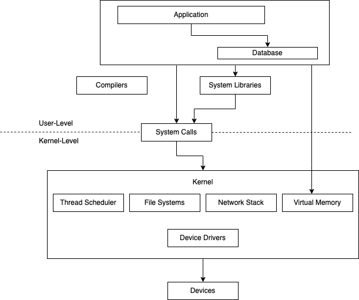

# Introduction to Systems Performance

## Table of Contents
* [Introduction](#introduction)
* [Workload Analysis vs Resource Analysis](#workload-analysis-vs-resource-analysis)
* [Performance is Difficult](#performance-is-difficult)

## Introduction

Systems performance studies the performance of an entire computer system, including all major software and hardware components. 

Anything in the data path can affect systems performance, so **if you don't have a diagram of your environment showing the data path, find one or draw it yourself**!

The typical goals of systems performance are to:
1. Improve the end-user experience by **reducing latency**
2. **Reduce computing cost**. Reducing cost can be achieved by eliminating inefficiencies, improving system throughput and general tuning.

Cloud computing provides new techniques for proof-of-concept testing. One such technique is called **canary testing** where **new software is tested on a single instance with a fraction of the production workload**. 

Another technique called **blue-green deployment** utilizes canary testing as a normal step in deployment: **traffic is gradually moved to a new pool of instances while leaving the old pool online as backup**.

## Workload Analysis vs Resource Analysis

Performance analysis is typically viewed from two different perspectives:
1. **Resource Analysis** - commonly employed by system administrators, they take a bottom up approach of looking at the software stack. They investigate the devices and hardware first.
2. **Workload Analysis** -  commonly employed by application developers, they take a top down approach of looking at the software stack. They investigate the application deployed on top of the hardware.

## Performance is difficult

Systems performance engineering can be a difficult field. The number one reason is that **performance is subjective**. 

Things tend to either work or not in typical software development. That's not the case with performance. What may be considered "bad" performance by one user will be considered "good" by another.

**Subjective performance can be made objective by defining clear goals**, such as having a target average response time, or requiring a percentage of requests to fall within a certain latency. 

The **second reason that performance engineering is hard is that the systems are complex**. If you are solely focused on application engineering, it's pretty easy to figure out where to start. With the code you wrote. With systems performance engineering, you need to think about the problem holistically and use clues to figure out where to start. 

Performance issues might also ber caused by a complex characteristic of a production workload. These cases may never be reproducible in a lab environment or only intermittently so :( .

Additionally, in complex software systems there are typically many performance issues! Thus, **the goal of a performance engineer is to identify which issues matter the most** in a system.

To do this, **the performance engineer must quantify the magnitude of issues**. A metric well-suited to performance quantification is **latency**. Latency is a **measure of time spent waiting**. Be careful! Latency can be ambiguous without qualifying terms. For instance, within networking, latency can mean the time for a connection to be established but not the data transfer time.