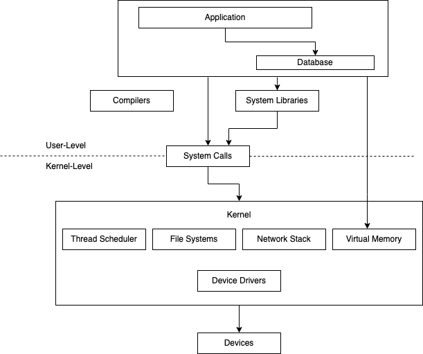
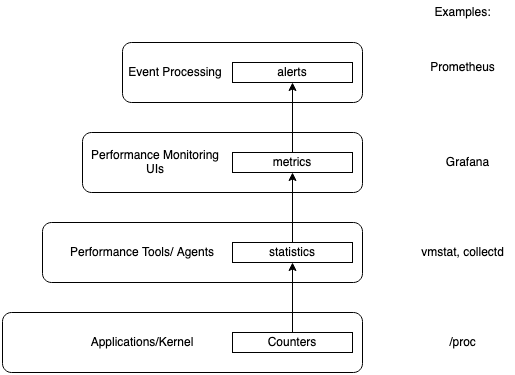
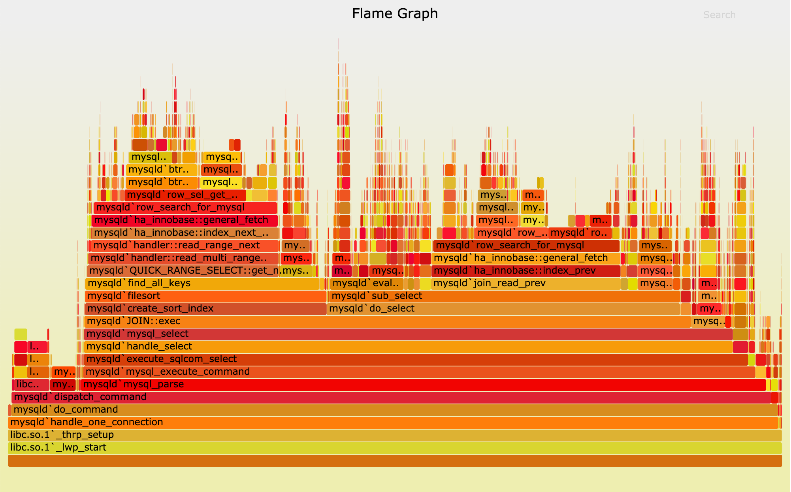

# Introduction to Systems Performance

## Table of Contents
* [Introduction](#introduction)
* [Workload Analysis vs Resource Analysis](#workload-analysis-vs-resource-analysis)
* [Performance is Difficult](#performance-is-difficult)
* [Observability](#observability)
    * [Counters, Statistics, and Metrics](#counters-statistics-and-metrics)
    * [Profiling Tools](#profiling-tools)
    * [Tracing](#tracing)
        * [Static Instrumentation](#static-instrumentation)
        * [Dynamic Instrumentation](#dynamic-instrumentation)
* [Experimentation](#experimentation)
* [Methodologies](#methodologies)
    * [Linux Performance in 60 Seconds](#linux-performance-analysis-in-60-seconds)

## Introduction

Systems performance studies the performance of an entire computer system, including all major software and hardware components. 

Anything in the data path can affect systems performance, so **if you don't have a diagram of your environment showing the data path, find one or draw it yourself**!

The typical goals of systems performance are to:
1. Improve the end-user experience by **reducing latency**
2. **Reduce computing cost**. Reducing cost can be achieved by eliminating inefficiencies, improving system throughput and general tuning.

Cloud computing provides new techniques for proof-of-concept testing. One such technique is called **canary testing** where **new software is tested on a single instance with a fraction of the production workload**. 

Another technique called **blue-green deployment** utilizes canary testing as a normal step in deployment: **traffic is gradually moved to a new pool of instances while leaving the old pool online as backup**.

## Workload Analysis vs Resource Analysis

Performance analysis is typically viewed from two different perspectives:
1. **Resource Analysis** - commonly employed by system administrators, they take a bottom up approach of looking at the software stack. They investigate the devices and hardware first.
2. **Workload Analysis** -  commonly employed by application developers, they take a top down approach of looking at the software stack. They investigate the application deployed on top of the hardware.

## Performance is difficult

Systems performance engineering can be a difficult field. The number one reason is that **performance is subjective**. 

Things tend to either work or not in typical software development. That's not the case with performance. What may be considered "bad" performance by one user will be considered "good" by another.

**Subjective performance can be made objective by defining clear goals**, such as having a target average response time, or requiring a percentage of requests to fall within a certain latency. 

The **second reason that performance engineering is hard is that the systems are complex**. If you are solely focused on application engineering, it's pretty easy to figure out where to start. With the code you wrote. With systems performance engineering, you need to think about the problem holistically and use clues to figure out where to start. 

Performance issues might also ber caused by a complex characteristic of a production workload. These cases may never be reproducible in a lab environment or only intermittently so :( .

Additionally, in complex software systems there are typically many performance issues! Thus, **the goal of a performance engineer is to identify which issues matter the most** in a system.

To do this, **the performance engineer must quantify the magnitude of issues**. A metric well-suited to performance quantification is **latency**. Latency is a **measure of time spent waiting**. Be careful! Latency can be ambiguous without qualifying terms. For instance, within networking, latency can mean the time for a connection to be established but not the data transfer time.

## Observability

**Observability** refers to **understanding a system through observation**. The tools used for observability are **counters**, **profiling** and **tracing**. It does not include benchmarking tools because they modify the state of the system by performing a workload experiment.

When trying to discern a problem, **observability tools should be tried first whenever possible**.

### Counters, Statistics and Metrics

**Applications and the kernel** typically provide **data on their state and activity**. They are typically **implemented as integer variables** called **counters** that are hard-coded in the software. 

Some counters are cumulative. These counters can be read at different times by tools for calculating statistics: the rate of change over time, the average, percentiles, etc.

A **metric** is **a statistic that has been selected to evaluate or monitor a target**. Most companies use monitoring agents to record selected statistics at regular intervals and chart them in a graphical interface for easy reading. Monitoring software can also support creating custom alerts from these metrics.

Sometimes time-series metrics are all that is needed to resolve a performance issue. Other times, metrics can only point in a direction, suggesting that there is a CPU or disk issue that needs to be investigated.

### Profiling Tools

In systems performance, the term **profiling** refers to the use of tools that **take a subset of measurements (a sample) to paint a coarse picture of the target**. 

CPUs are a common profiling target. The commonly used method to profile CPUs involves taking **timed-interval samples of the on-CPU code paths**.

An effective visualization of CPU profiles is **flame graphs**. CPU flame graphs **can help you find more performance wins than any other tool aside from metrics**.

The **widths are proportional to the CPU time spent**, and the **vertical axis shows the code path**.

### Tracing

**Tracing** is **event-based recording**, where **event data is captured and saved for later analysis** or **consumed on-the-fly for custom summaries**.

There are special purpose tracing tools for [system calls, `strace`](https://github.com/lkrych/linux_notes/blob/ab26680bafb852377101ae96945bfaf4efb68d38/chapters/6_sys_config_utilization.md#tracing-program-execution), and [network packets, `tcpdump`](https://github.com/lkrych/network_programming/blob/7844140da124c04964d7665c1c11b74b2a9e5e7b/network_cheatsheet.md#tcpdump). There are even general purpose tracing tools that can analyze the execution of all software and hardware events (Linux `Ftrace`, `BCC`, and `bpftrace`).

Tracing tools can be **statically or dynamically instrumented**.

#### Static Instrumentation

**Static instrumentation** describes **hard-coded software instrumentation points** added to the source code. 

There are hundreds of these points in the Linux kernel that instrument disk I/O, scheduler events, system calls and more. The **Linux technology for kernel static instrumentation** is called **tracepoints**.

There is also a **static instrumentation technology for user-space** software called **user statically defined tracing (USDT)**. USDT is used by pibraries for instrumenting library calls.

An example tool that uses static instrumentation, `execsnoop`prints new processes created while it is tracing by instrumenting a tracepoint for the `execve` system call.

This tool is **especially useful for revealing short-lived processes**.

#### Dynamic Instrumentation

**Dynamic instrumentation creates instrumentation points after the software is running** by **modifying in-memory instructions to insert instrumentation routines**. This method is similar to how debuggers can insert breakpoints on an function in running software.

This allows custom performance statistics to be created from any running software. Dynamic instrumentation is very different from traditional observation. 

`DTrace` was the first easy to use dynamic tracing tools `BPF` is powering the latest dynamic tracing tools for Linux. BPF originated as a mini in-kernel VM for speeding up the execution of `tcpdump` expressions. It has since been extended to become a **generic in-kernel execution environment**, one that provides safety and fast access to resources.

## Experimentation

Apart from observability tools, there are also experimentation tools, most of which are benchmarking tools. These **perform an experiment by applying a synthetic workload to the system and measuring its performance**.

## Methodologies

**Methodologies** are **a way to document the recommended steps for performing various tasks in systems performance**. They help prevent investigations from turning into fishing expeditions (trying random things).

### Linux Performance Analysis in 60 seconds

| Tool | Check |
| --- | ---|
| `uptime` | Load average to identify if load is increasing or decreasing in 1, 5 and 15 minute averages |
| `dmesg -T | tail` | Kernel errors including OOM events |
| `vmstat -SM ` | System-wide statistics: run queue length, swapping, overall CPU usage. |
| `mpstat -P ALL 1` | Per-CPU balance: a single busy CPU can indicate poor thread scaling |
| `pidstat 1` | Per-process CPU usage: identify unexpected CPU consumers, and user/system CPU time for each process |
| `iostat -sxz ` | Disk I/O statistics: IOPS and throughput, average wait time, percent busy |
| `free -m` | Memory usage including the file system cache |
| `sar -n DEV 1` | network device I/O: packets and throughput |
| `sar -n TCP,ETCP 1` | TCP statistics: connection rates, retransmits |
| `top` | System overview |