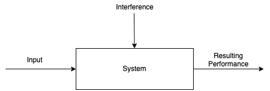
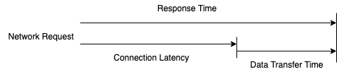

# Methodologies

## Table of Contents
* [Introduction](#introduction)
* [Terminology](#terminology)
* [Mental Models](#mental-models)
* [Useful Concepts](#useful-concepts)
    * [Latency](#latency)
    * [Time Scales](#time-scales)

## Introduction

When learning anything new, you need to learn what something is before you can start working it into your mental model of how things work. Computer systems are no different. You can graduate from school with a good understanding of how an operating system works, but where do you learn how to manage one? This is where experience comes in.

In systems performance, experience allows you to know which metrics are important and how to use them to narrow down an investigation. It is extremely hard to teach the hard-won knowledge of experience.

The solution to this problem is to teach **methodologies**: **strategies and mental models for approaching performance engineering**. These methodologies are the building blocks of all the tools that we will address in later chapters.

## Terminology

1. **IOPS** - **(Input/output operations per second)** is a measure of the **rate of data transfer operations**.
2. **Throughput** - The rate of work performed. Especially in communications, the term is used to refer to the data rate (bytes per second, etc.) 
3. **Response time** - **The time for an operation to complete**. This includes any time spent being serviced, including the time to transfer the result.
4. **Latency** - A measure of **time an operation spends waiting** to be serviced. In some instances, latency can refer to the entire time of an operation, essentially the same as response time.
5. **Utilization** - For resources that service requests, utilization is a **measure of how busy a resource is**, based on how much time inn a given interval it was actively performing work.
6. **Saturation** -  The degree to which a resource has queued work it cannot service.
7. **Bottleneck** - In systems performance, a bottleneck is **a resource that limits the performance of the system**. Identifying and removing system bottlenecks is a key activity of systems performance.
8. **Workload** - The **input to the system** or the load applied is the workload.
9. **Cache** - A **fast storage area** that can duplicate or buffer a limited amount of data, to avoid communicating directly with a slower tier of storage, thereby improving performance.

## Mental Models

When looking at the performance of your systems it is important to always be aware that **interference can affect your results**. Interference can stem from scheduled system activity, other users of the system, and other workloads.

The origin of the interference might not be obvious, it can be particularly difficult in some cloud environments because you won't have visibility into the activity of other users.

Another useful mental model is the queuing system. Disks are commonly modeled as queueing systems. We'll talk more formally about queuing systems later.

## Useful Concepts

### Latency

For some environments, latency is the sole focus of performance. For others, it is one of the top metrics for analysis, along with throughput.

The **latency** is the **time spent waiting before an operation is performed**. In the example above, the operation is a network service request to transfer data. Before this operation can take place, the **system must wait for a network connection to be established**, which is **the latency** for this operation. The **response** time is the this **latency and the operation time**.

Because **latency can be measured from different locations**, it is **often expressed with the target of measurement**. For example, the load time for a website may be composed of three different times measured from different locations: DNS latency, TCP connection latency, and then TCP data transfer time.

One of the most convenient things about latency is that it is a time-based metric, and various calculations can be used with it. Performance issues can be quantified using latency and then ranked because they are expressed using the same units (time).

### Time Scales

It helps to have an **instinct about time** and reasonable expectations for latency from different sources within a computing system.

**Example time scale of system latencies**

| Event | Latency | Scaled |
| ----- | ------- | ------ |
| 1 CPU cycle | 0.3 ns | 1 s |
| Level 1 cache access |  0.9 ns | 3 s |
| Level 2 cache access | 3 ns | 10 s |
| Level 3 cache access | 10 ns | 33 s |
| Main memory access (DRAM, from CPU) | 100 ns | 6 min |
| Solid-state disk I/O (flash) | 10 - 100 μs | 9 - 90 hrs |
| Rotational disk I/O | 1 - 10 ms | 1 - 12 months | 
| Internet: SF to NYC | 40 ms | 4 years |
| Internet: SF to UK | 81 ms | 8 years |
| Lightweight hardware virtualization boot | 100 ms | 11 years |
| Internet: SF to Australia | 183 ms | 19 years |
| OS virtualization system boot | <1 s | 105 years |
| TCP timer-based retransmit | 1-3 s | 105-317 years |
| SCSI command time-out | 30 s | 3 millennia |
| Hardware virtualization system boot | 40 s | 4 millennia |
| Physical System reboot | 5m | 32 millennia |

**CPUs are amazing**. The time it takes light to travel 0.5 m, maybe the distance from your computer screen to your eyeballs is about 1.7 ns. During the same time, a modern CPU may have execute 5 CPU cycles and processed some instructions!
