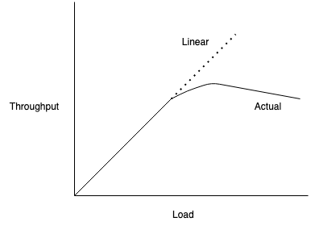
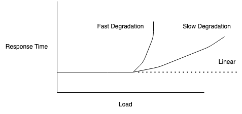

# Methodologies

## Table of Contents
* [Introduction](#introduction)
* [Terminology](#terminology)
* [Mental Models](#mental-models)
* [Useful Concepts](#useful-concepts)
    * [Latency](#latency)
    * [Time Scales](#time-scales)
    * [Trade-offs and Where to tune](#trade-offs-and-where-to-tune)
    * [Point-in-Time Recommendations](#point-in-time-recommendations)
    * [Load vs. Architecture](#load-vs-architecture)
    * [Scalability](#scalability)
    * [Performance Metrics](#performance-metrics)
    * [Utilization](#utilization)
    * [Saturation](#saturation)
    * [Caching](#caching)
* [Methodologies](#methodologies)
    * [Anti-Methods](#anti-methods)
    * [Ad-hoc Checklist](#ad-hoc-checklist)
    * [Problem Statement](#problem-statement)
    * [USE Method](#use-method)
    * [Workload Characterization](#workload-characterization)
    * [Five Whys](#five-whys)
    * [Cache Tuning](#cache-tuning)
    * [Performance Mantras](#performance-mantras)
## Introduction

When learning anything new, you need to learn what something is before you can start working it into your mental model of how things work. Computer systems are no different. You can graduate from school with a good understanding of how an operating system works, but where do you learn how to manage one? This is where experience comes in.

In systems performance, experience allows you to know which metrics are important and how to use them to narrow down an investigation. It is extremely hard to teach the hard-won knowledge of experience.

The solution to this problem is to teach **methodologies**: **strategies and mental models for approaching performance engineering**. These methodologies are the building blocks of all the tools that we will address in later chapters.

## Terminology

1. **IOPS** - **(Input/output operations per second)** is a measure of the **rate of data transfer operations**.
2. **Throughput** - The rate of work performed. Especially in communications, the term is used to refer to the data rate (bytes per second, etc.) 
3. **Response time** - **The time for an operation to complete**. This includes any time spent being serviced, including the time to transfer the result.
4. **Latency** - A measure of **time an operation spends waiting** to be serviced. In some instances, latency can refer to the entire time of an operation, essentially the same as response time.
5. **Utilization** - For resources that service requests, utilization is a **measure of how busy a resource is**, based on how much time inn a given interval it was actively performing work.
6. **Saturation** -  The degree to which a resource has queued work it cannot service.
7. **Bottleneck** - In systems performance, a bottleneck is **a resource that limits the performance of the system**. Identifying and removing system bottlenecks is a key activity of systems performance.
8. **Workload** - The **input to the system** or the load applied is the workload.
9. **Cache** - A **fast storage area** that can duplicate or buffer a limited amount of data, to avoid communicating directly with a slower tier of storage, thereby improving performance.

## Mental Models


When looking at the performance of your systems it is important to always be aware that **interference can affect your results**. Interference can stem from scheduled system activity, other users of the system, and other workloads.

The origin of the interference might not be obvious, it can be particularly difficult in some cloud environments because you won't have visibility into the activity of other users.


Another useful mental model is the queuing system. Disks are commonly modeled as queueing systems. We'll talk more formally about queuing systems later.

## Useful Concepts

### Latency

For some environments, latency is the sole focus of performance. For others, it is one of the top metrics for analysis, along with throughput.


The **latency** is the **time spent waiting before an operation is performed**. In the example above, the operation is a network service request to transfer data. Before this operation can take place, the **system must wait for a network connection to be established**, which is **the latency** for this operation. The **response** time is the this **latency and the operation time**.

Because **latency can be measured from different locations**, it is **often expressed with the target of measurement**. For example, the load time for a website may be composed of three different times measured from different locations: DNS latency, TCP connection latency, and then TCP data transfer time.

One of the most convenient things about latency is that it is a time-based metric, and various calculations can be used with it. Performance issues can be quantified using latency and then ranked because they are expressed using the same units (time).

### Time Scales

It helps to have an **instinct about time** and reasonable expectations for latency from different sources within a computing system.

**Example time scale of system latencies**

| Event | Latency | Scaled |
| ----- | ------- | ------ |
| 1 CPU cycle | 0.3 ns | 1 s |
| Level 1 cache access |  0.9 ns | 3 s |
| Level 2 cache access | 3 ns | 10 s |
| Level 3 cache access | 10 ns | 33 s |
| Main memory access (DRAM, from CPU) | 100 ns | 6 min |
| Solid-state disk I/O (flash) | 10 - 100 μs | 9 - 90 hrs |
| Rotational disk I/O | 1 - 10 ms | 1 - 12 months | 
| Internet: SF to NYC | 40 ms | 4 years |
| Internet: SF to UK | 81 ms | 8 years |
| Lightweight hardware virtualization boot | 100 ms | 11 years |
| Internet: SF to Australia | 183 ms | 19 years |
| OS virtualization system boot | <1 s | 105 years |
| TCP timer-based retransmit | 1-3 s | 105-317 years |
| SCSI command time-out | 30 s | 3 millennia |
| Hardware virtualization system boot | 40 s | 4 millennia |
| Physical System reboot | 5m | 32 millennia |

**CPUs are amazing**. The time it takes light to travel 0.5 m, maybe the distance from your computer screen to your eyeballs is about 1.7 ns. During the same time, a modern CPU may have execute 5 CPU cycles and processed some instructions!

### Trade-offs and Where to tune

A common trade-off in performance tuning is the one **between CPU and memory**, as memory can be used to cache results, it reduces CPU usage.  On modern system with an abundance of CPU, the trade may work the other way: CPU time may be spent compressing data to reduce memory usage.

**Tunable parameters often come with trade-offs**. 

For instance, with block size (file system record size). Small block sizes, close to the application I/O size, will perform better for random I/O workloads and make more efficient use of the file system cache. Large block sizes will improve streaming workloads.

Another trade-off is network buffer size, small buffer sizes will reduce the memory overhead per connection, helping the system scale. Large sizes will improve network throughput.

One question might be in your head, where you should begin looking to tune something? The correct answer is that you **performance tuning is most effective when done closest to where the work is performed**.

**Example Targets of Tuning**

| Layer | Example Tuning Targets |
| ---- | ------ |
| Application |  Application logic, request queue sizes, database queries performed |
| Database | Database table layout, indexes, buffering |
| System Calls | Memory-mapped or read/write, sync of async I/O flags |
| File System | Record size, cache size, journaling |
| Storage | RAID level, number and type of disks |

### Point-in-Time Recommendations

The performance characteristics of ann environment change over time. Thus, **performance recommendations**, especially the values of tunable parameters, **are valid only at a specific point in time**. 

### Load vs. Architecture

An application can perform badly due to an issue with how it was designed (architecture and implementation) as well as perform badly simply due to too much load being applied, resulting in queueing and long latencies.

If analysis of the architecture shows queueing of work but no problems with how the work is performed, the issue might be due to load. In cloud computing, you can scale horizontally to handle the work.

Ann issue of architecture might be using a single-threaded application that is busy on the CPU while requests are queuing and other other CPUs are idle. In this case, performance is limited by the application's single-threaded architecture.


### Scalability

The **performance of a system under increasing load** is its **scalability**.



The above image shows a typical throughput profile as a system's load increases. For some period, linear scalability is observed. A point is then reached, where the the **contention for a resource begins to degrade throughput**. 

This point can be described as a knee point, it is the boundary between two functions. Beyond this point, the throughput profile departs from linear scalability as contention for the resource increases.

This point may occur when a component reaches 100% utilization: the saturation point.

An example system that would exhibit this profile is an application that performs heavy computation, with more load added as additional threads. As the CPUs approach 100% utilization, response time begins to degrade as CPU scheduler latency increases. After peak performance, at 100% utilization, throughput begins to decrease as more threads are added. This causes more context switches, which consume CPU resources and cause less actual work to be completed.



The degradation of performance for nonlinear scalability is graphed above. Higher response time is bad. The fast degradation profile may occur for memory load, when the system begins moving memory pages to disk to free main memory. The slow degradation profile may occur for CPU load.

### Performance Metrics

Performance metrics are **selected statistics** generated by the system, applications, or additional tools that **measure activity of interest**. Common types of system performance metrics include: throughput, IOPS, Utilization, and Latency.

**Performance metrics are not free**. At some point CPU cycles must be spent to gather and store them. This causes overhead which can negatively affect the performance of the target or measurement.

### Utilization

The term **utilization** is often used for operating systems to describe **device usage**. It can be **time-based or capacity-based**.

**Time-based utilization** is the **average amount of time a resource was busy**.

```
U = B/T

U = Utilization
B = Total time the system was busy
T = The observation period 
```

**Time-based utilization** is **most readily available from operating system performance tools**. The disk monitoring tool `iostat` calls this metric %b for percent busy.

This metric tells us how busy a component is, when a component approaches 100% utilization, performance can seriously degrade when there is contention for that resource.

Some **components in a computing system can service multiple operations in parallel**. For them, **performance may not degrade much at 100% utilization** as they can accept more work. This is non-intuitive so let's take a real world example. Consider an elevator. It may be considered utilized when it is moving between floors and not utilized when it is waiting. This elevator may be able to accept more passengers even when it is 100% busy.

A disk that is 100% busy may also be able to accept and process more work. Storage arrays frequently run at 100% because some disk is busy 100% of the time, but the array typically has plenty of idle disks that can accept more work.

**Capacity-based utilization defines utilization in terms of capacity** instead of time. It implies that **a disk at 100% utilization cannot accept any more work**.

If we take the elevator example, 100% capacity mean that the elevator has accepted the maximum amount of people.

### Saturation

The **degree to which more work is requested of a resource than it can process** is **saturation**. Saturation **begins at 100% utilization** (capacity-based), as extra work cannot be processed and begins to queue.

Any degree of saturation is a performance issue.

### Caching

Caching is frequently used to improve performance. **A cache stores results from a slower storage tier in a faster storage tier**. Multiple tiers of caches may be used. For example, CPUs commonly employ multiple hardware caches for main memory (L1, L2 and L3). Beginning with a fast and very small cache and increasing in both storage size and access latency.

One important metric for **understanding cache performance** is each cache's **hit ratio**: the number of times the needed data was found in the cache (hits) versus the total access (hits + misses). The higher the better.

The performance difference between 98% and 99% cache hit rate is much greater than between 10% and 11%. This is nonlinear because of the difference in speed between cache hits and misses. The noticeable difference in operations that hit the cache will be much more noticeable at 98% than at 10%.

## Methodologies

Methodologies help you approach complex systems by showing when to start you analysis and suggesting an effective procedure to follow.
### Anti-Methods

We're going to begin this discussion with **things you should not do**. 

**Streetlight Anti-Method** - A user analyzes performance by choosing familiar or random observability tools. This approach is hit or miss and can overlook many types of issues.

**Random Change Anti-Method** - A user randomly guesses where the problem may be and then changes things until it goes away. While this method may unearth something it is too tie-consuming and also result in tuning that doesn't make any sense.

**Blame Someone Else Anti-Method** - Instead of investigating an issue, this methodology makes the issues someone elses problem. This can be identified by a lack of data leading to a hypothesis that it is someone else's problem!

### Ad-hoc Checklist

Going through a canned checklist is a common methodology. It can actually provide a lot of value, especially if you know what you are looking at. However, the problem with them is that they are typically point-in-time recommendations and these checklists need to be refreshed to stay current. That being said, they are an effective way to ensure that everyone knows how to check for common issues.

### Problem Statement

Answering the following questions should be the **first thing you do when responding to an issue**:

1. What makes you think there is a performance problem?
2. Has this system ever performed well?
3. What changed recently? Software? Hardware? Load?
4. Can the problem be expressed in terms of latency?
5. Does the problem affect other people or applications?
6. What is the environment? What software and hardware are used?

### USE Method

The USE method stands for utilization, saturation and errors method. It should be used early in an investigation to identify systemic bottlenecks. 

It's pretty simple: **for every resource check utilization, saturation and errors**. 

Always **check errors first** because they are quick to interpret, and it can be time-efficient to rule them out.

Though it may seem counterintuitive, **a short burst of high utilization can cause saturation and performance issues**, even though overall utilization is low over a long interval. Some monitoring tools report utilization over 5 minute intervals, these long intervals might disguise short periods of 100% utilization.

To decide which system components to look at, draw a functional block diagram that shows how data flows through the system. Check each of the points in the system.

| Resource | Type | Metric |
| ---- | ----- | ------|
| CPU    | Utilization   | CPU utilization either per CPU or system-wide   |
| CPU   | Saturation     | Run queue length, scheduler latency, CPU pressure (Linux PSI) | 
| Memory | Utilization | Available free memory (system-wide) |
| Memory    | Saturation | Swapping, page scanning, out-of-memory events, memory pressure (Linux PSI) |
| Network Interface    | Utilization  | Receive throughput/max bandwidth, transmit throughput/max bandwidth |
| Storage Device I/O    | Utilization  | device busy percent |
| Storage Device I/O    | Saturation  | wait queue length, I/O pressure (Linux PSI) |
| Storage Device I/O | Errors | Device errors ("soft", "hard") |

In **cloud computing environments**, **system resource controls may be in place** to limit or throttle tenants who are sharing one system. This may limit memory, CPU, disk I/O, and network I/O.

### Workload Characterization

Workload characterization is a simple and effective method for **identifying a class of issues due to load**.

Workloads can be characterized by the following questions:

1. **Who is causing the load?** Process ID, User ID, remote IP address
2. **Why is the load being called?** Code Path, stack trace?
3. **What are the load characteristics?** IOPS, throughput, direction, type?
4. **How is the load changing over time?** Is there a daily pattern?

**The best performance wins are the result of eliminating unnecessary work.** Characterizing workload can identify these issues.

### Five Whys

This is very simple but often very effective. Ask yourself "why?" then answer the question, and repeat this process five or more times.

1. A database has begun to perform poorly for many queries. Why?
2. It is delayed by disk I/O due to memory paging. Why?
3. Database memory usage has grown too large. Why?
4. The allocator is consuming more memory then it should. Why?
5. The allocator has a memory fragmentationn issue.

### Cache Tuning

Applications and Operating Systems employ multiple caches to improve I/O performance from the application down to the disks. Here is a general strategy for tuning each cache level.

1. Aim to cache as high in the stack as possible, closer to where the work is performed. This location should also have metadata available, which can be used to improve the cache retention policy.
2. Check that the cache is enabled and working.
3. Check that the cache hit/miss ratios and miss rate
4. If the cache size is dynamic, check its current size.
5. Tune the cache for the workload. This task depends on available  cache tunable parameters
6. Tune the workload for the cache.

### Performance Mantras

This is general advice for how to best improve performance.

1. **Don't do it**: eliminate unnecessary work
2. **Do it, but don't do it again**: caching
3. **Do it less**: tune refreshes, polling or updates to happen less frequently
4. **Do it later**: write-back caching
5. **Do it when they're not looking**: Schedule work to run during off-peak hours
6. **Do it concurrently**: switch from single-threaded to multi-threaded.
7. **Do it more cheaply**: Buy faster hardware.