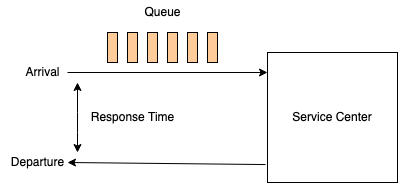

# Methodologies

## Table of Contents
* [Introduction](#introduction)
* [Terminology](#terminology)
* [Mental Models](#mental-models)
* [Useful Concepts](#useful-concepts)

## Introduction

When learning anything new, you need to learn what something is before you can start working it into your mental model of how things work. Computer systems are no different. You can graduate from school with a good understanding of how an operating system works, but where do you learn how to manage one? This is where experience comes in.

In systems performance, experience allows you to know which metrics are important and how to use them to narrow down an investigation. It is extremely hard to teach the hard-won knowledge of experience.

The solution to this problem is to teach **methodologies**: **strategies and mental models for approaching performance engineering**. These methodologies are the building blocks of all the tools that we will address in later chapters.

## Terminology

1. **IOPS** - **(Input/output operations per second)** is a measure of the **rate of data transfer operations**.
2. **Throughput** - The rate of work performed. Especially in communications, the term is used to refer to the data rate (bytes per second, etc.) 
3. **Response time** - **The time for an operation to complete**. This includes any time spent being serviced, including the time to transfer the result.
4. **Latency** - A measure of **time an operation spends waiting** to be serviced. In some instances, latency can refer to the entire time of an operation, essentially the same as response time.
5. **Utilization** - For resources that service requests, utilization is a **measure of how busy a resource is**, based on how much time inn a given interval it was actively performing work.
6. **Saturation** -  The degree to which a resource has queued work it cannot service.
7. **Bottleneck** - In systems performance, a bottleneck is **a resource that limits the performance of the system**. Identifying and removing system bottlenecks is a key activity of systems performance.
8. **Workload** - The **input to the system** or the load applied is the workload.
9. **Cache** - A **fast storage area** that can duplicate or buffer a limited amount of data, to avoid communicating directly with a slower tier of storage, thereby improving performance.

## Mental Models

When looking at the performance of your systems it is important to always be aware that **interference can affect your results**. Interference can stem from scheduled system activity, other users of the system, and other workloads.

The origin of the interference might not be obvious, it can be particularly difficult in some cloud environments because you won't have visibility into the activity of other users.

Another useful mental model is the queuing system. Disks are commonly modeled as queueing systems. We'll talk more formally about queuing systems later.

## Useful Concepts