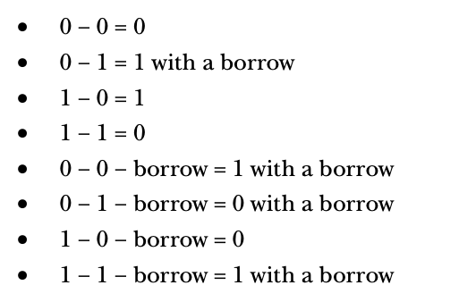
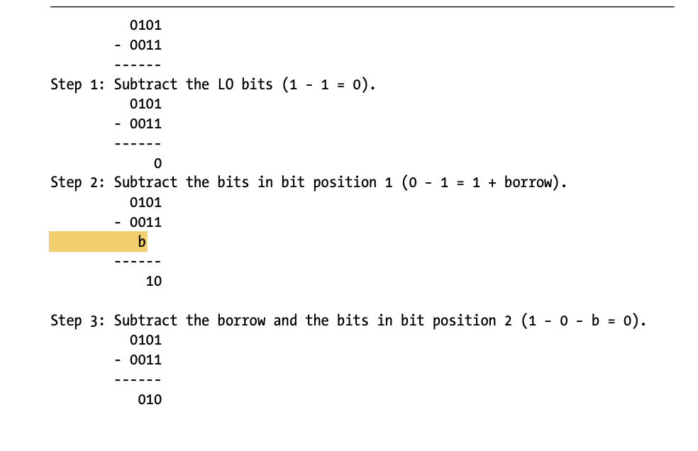
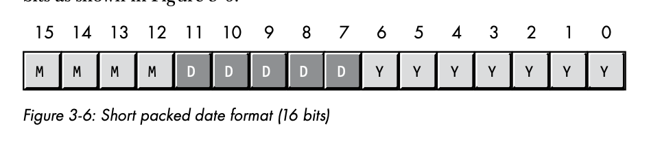

# Binary Arithmetic and Bit Operations

## Table of Contents

* [Arithmetic Operations on Binary and Hexadecimal Numbers](#arithmetic-operations-on-binary-and-hexadecimal-numbers)
    * [Adding Binary Values](#adding-binary-values)
    * [Subtracting Binary Values](#subtracting-binary-values)
    * [Multiplying Binary Values](#multiplying-binary-values)
    * [Dividing Binary Values](#dividing-binary-values)
* [Logical Operations on Bits](#logical-operations-on-bits)
* [Logical Operations on Binary Numbers and Bit Strings - Masking](#logical-operations-on-binary-numbers-and-bit-strings-masking)
 * [Useful Bit Operations](#useful-bit-operations)
    * [Testing Bits in a Bit String using AND](#testing-bits-in-a-bit-string-using-and)
    * [Testing a Set of Bits for Zero/Non-Zero using AND](#testing-a-set-of-bits-for-zerononzero-using-and)
    * [Modulo-N Counters](#modulon-counters)
* [Shifts and Rotates](#shifts-and-rotates)
* [Bit Fields and Packed Data](#bit-fields-and-packed-data)

## Arithmetic Operations on Binary and Hexadecimal Numbers

#### Adding Binary Values

**Rules**


**Example**


#### Subtracting Binary Values

**Rules**




**Example**




#### Multiplying Binary Values

**Rules**


**Example**


#### Dividing Binary Values

**Rules**

Binary division uses the same division algorithm as decimal division.

At each step in the binary algorithm, the divisor goes into the remainder exactly zero or one times.

**Example**


## Logical Operations on Bits

There are four main logical operators: 
* **AND**
    * 
    * If the first operand is 1 and the second operand is 1, the result is 1, otherwise the result is 0.
    * The logical AND operation is useful for forcing a 0 result.
* **OR**
    * 
    * If the first operand or the second operand or both is 1, the result is 1, otherwise the result is 0.
* **XOR**
    * If the first or second operand but not both is 1, the result is 1, otherwise the result is zero
* **NOT**
    * If the operand is 1, the result is 0. If the operand is 0, the result is 1.


## Logical Operations on Binary Numbers and Bit Strings - Masking

Because most programming languages manipulate groups of 8, 16, 32, or 64 bits, we need to extend the definition of our logical operations.

Given two values, a bitwise logical function operates on bit 0 from both source operands.

Let's look at an example of a bitwise AND.


* **AND/OR** - force bits to 0 or 1
* **XOR** - invert bits

For example, if you have an 8-bit binary value X and you want to guarantee that bits 4 through 7 contain 0s.

1. AND the value X with the binary value %OOOO_1111

This bitwise AND operations forces the HO bits of X to 0 and leaves the LO bits unchanged.

This process of **manipulating bit strings with the logical AND/OR/XOR** operations is known as **masking**. 

## Useful Bit Operations

### Testing Bits in a Bit String using AND

You can use the bitwise AND operator to test individual bits in a bit string to see if they are 0 or 1. **If you logically AND a value with a bit string that contains a 1 in a certain bit position, the result of the AND will be 0 if the corresponding bit contains 0 and nonzero if the bit contains 1.**


### Testing a Set of Bits for Zero/Non-Zero using AND

You can also use a bitwise AND operator to see if all bits are set to 0. For example, **one way to check if a number is divisible by 16** is to see if the LO 4 bits are all 0s.


### Modulo-N Counters

A **modulo-n counter** counts from 0 to some maximum value and then resets to 0. They are great for creating repeated sequences of numbers.

You can **use these sequences to create circular queues and other objects that reuse array elements** upon encountering the end of the data structure.

The normal way to create a modulo-n counter is to add 1 to the counter, divide the result by n, and then keep the remainder.

```python
cntr := (cntr + 1) % n
```

However, **division is an expensive operation**, requiring far more time to execute than addition. **It is more efficient to implement modulo-n counters using a comparison rather then the remainder operation**.

```python
cntr += 1
if cntr >=  n:
    cntr = 0
```

For certain special cases, when `n` is a power of 2, you can increment a modulo-n counter more efficiently using the AND operation. Because the AND operation is much faster than division, AND-driven modulo-n operators are much more efficient than those using the remainder operator.

```python
# 0x1f = 31 (for n = 32)
cntr = (cntr + 1) & 0x1f
```

The assembly language code is especially efficient:
```
inc(eax);
and($1f, eax);
```

### Shifts and Rotates

Another set of logical operations on bit strings are the shift and rotate operations.

The **shift left operation** moves each bit in a bit string one position to the left.


So what goes into bit 0?
* A zero is shifted into bit 0.

Where does the HO bit end up?
* The previous value of the HO bit is the carry.

**Shifting the binary representation of a number one position to the left is equivalent to multiplying that value by 2**.

```python
>>> 1 << 1
2
>>> 2 << 1
4
```

The multiplication operation is usually slower than the shift left operation, most compilers are smart enough to translate a multiplication by a constant power of 2 into a shift left operation.

A **shift right operation** moves the data in the opposite direction.

**Shifting an unsigned binary value one position to the right divides the value by 2**. For example, if you shift the unsigned representation of 254($FE) one place to the right, you get 127($7F)

However, **if you shift the 8-bit two's complement binary representation** of -2 ($FE) one position to the right you get 127 ($F)! This is not correct!

To divide a signed number by 2 using a shift, we use a third shift operation, **arithmetic shift right**, which doesn't modify the value of the HO bit.


This generally produces the result you would expect. This operation always rounds the numbers to the closest integer that is less than or equal to the actual result.

## Bit Fields and Packed Data

CPUs operate most efficiently on byte, word, double-word and quad-word data types, but occasionally you'll need to work with a data type whose size is something other than 8, 16. 32 or 64 bits.

In such cases you **may be able to save some memory** by **packing** different strings of bits together as compactly as possible without wasting any bits to align a particular data-field on a byte boundary.

Let's consider a date of the form 04/02/01. It takes three numeric values to represent the date: month, day and year. 
* Months use the values 1 through 12, which requires at least 4 bits
* Days use the values 1 through 31, which requires at least 5 bits
* Years (assuming we are working with values 0 through 99), require 7 bits.



We can pack our date data into 2 bytes rather than the 3 that would be required if we used a separate byte for each value. This could be a substantial saving if you store many dates. 

Although packed values are **more space efficient, they are computation inefficient**. Why? It takes extra instructions to unpack the data from the various bit fields.

Let's look at a different form of packing.


Keeping in mind Y2K, adopting a date format that supports more than two digit years is better. Notice that this isn't really more space efficient than just using 3 different numeric values. It consumes the same 4 bytes as the unpacked version. This is an alternative definition of packing in which we aren't saving space, but we are saving computation. 

How are we saving computation? **By packing the data into a double-word variable, the program can treat the date value as a single data value rather than three separate variables**. This means you can use a single machine instruction on this data rather than three.

```
move(Date1, eax)
if (eax > Date2) then
// do something
endif
```

Always use your compiler to do this stuff for you if you can, it will automatically pack and and unpack the data for you.
