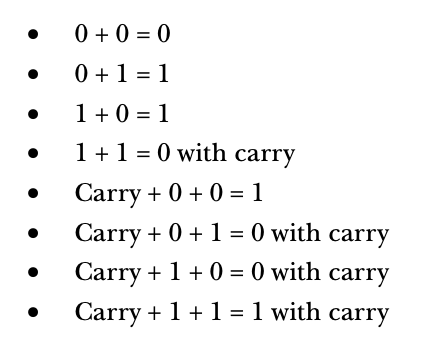

# Binary Arithmetic and Bit Operations

## Table of Contents

## Arithmetic Operations on Binary and Hexadecimal Numbers

#### Adding Binary Values

**Rules**

**Example**

#### Subtracting Binary Values

**Rules**

**Example**

#### Multiplying Binary Values

**Rules**

**Example**

#### Dividing Binary Values

**Rules**

Binary division uses the same division algorithm as decimal division.

At each step in the binary algorithm, the divisor goes into the remainder exactly zero or one times.

**Example**

## Logical Operations on Bits

There are four main logical operators: 
* **AND**
    * 
    * If the first operand is 1 and the second operand is 1, the result is 1, otherwise the result is 0.
    * The logical AND operation is useful for forcing a 0 result.
* **OR**
    * 
    * If the first operand or the second operand or both is 1, the result is 1, otherwise the result is 0.
* **XOR**
    * If the first or second operand but not both is 1, the result is 1, otherwise the result is zero
* **NOT**
    * If the operand is 1, the result is 0. If the operand is 0, the result is 1.

## Logical Operations on Binary Numbers and Bit Strings - Masking

Because most programming languages manipulate groups of 8, 16, 32, or 64 bits, we need to extend the definition of our logical operations.

Given two values, a bitwise logical function operates on bit 0 from both source operands.

Let's look at an example of a bitwise AND.

* **AND/OR** - force bits to 0 or 1
* **XOR** - invert bits

For example, if you have an 8-bit binary value X and you want to guarantee that bits 4 through 7 contain 0s.

1. AND the value X with the binary value %OOOO_1111

This bitwise AND operations forces the HO bits of X to 0 and leaves the LO bits unchanged.

This process of **manipulating bit strings with the logical AND/OR/XOR** operations is known as **masking**. 

## Useful Bit Operations

### Testing Bits in a Bit String using AND

You can use the bitwise AND operator to test individual bits in a bit string to see if they are 0 or 1. **If you logically AND a value with a bit string that contains a 1 in a certain bit position, the result of the AND will be 0 if the corresponding bit contains 0 and nonzero if the bit contains 1.**

### Testing a Set of Bits for Zero/Non-Zero using AND

You can also use a bitwise AND operator to see if all bits are set to 0. For example, **one way to check if a number is divisible by 16** is to see if the LO 4 bits are all 0s.

### Modulo-N Counters

